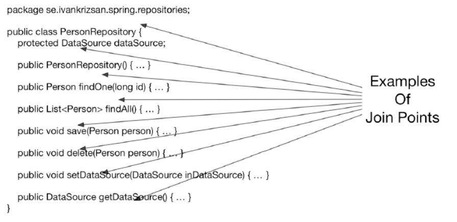
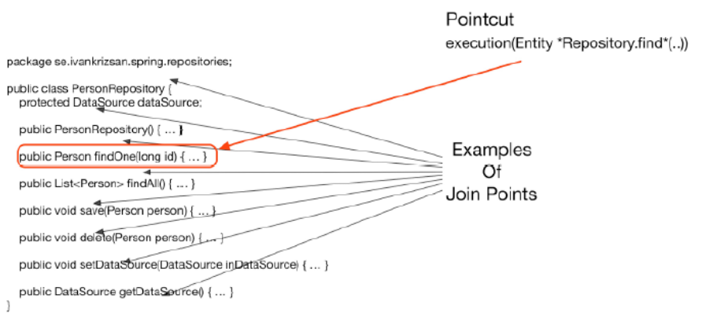
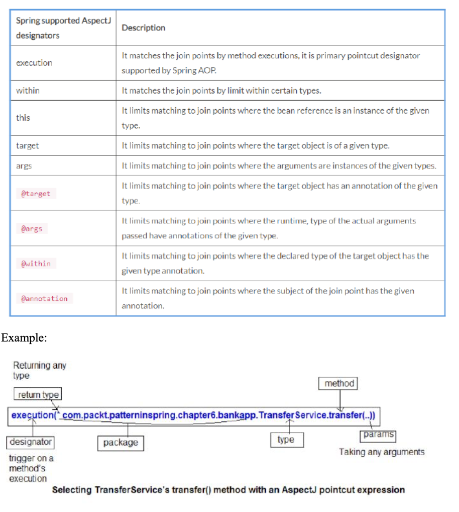
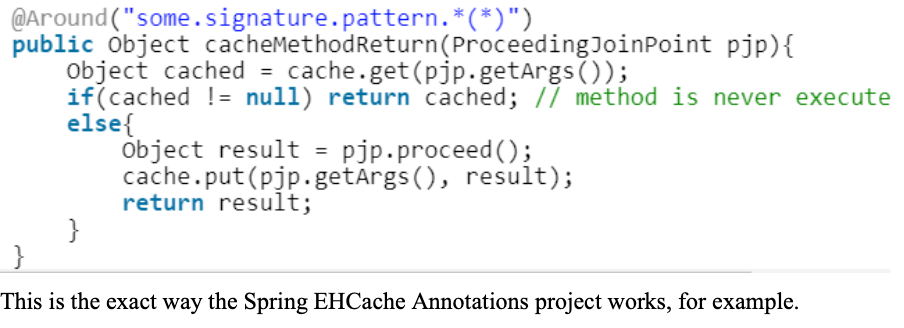

## What is the concept of AOP?
**Aspect-Oriented Programming (AOP)** enables modularization of cross-cutting concerns. It complements **Object-oriented programming (OOP)**. OOP has class and object as key elements but AOP has aspect as key element. Aspects allow you to modularize some functionality across the application at multiple points. This type of functionality is known as **cross-cutting concerns.**

## Which problem does it solve?
- Code tangling. Code tangling occurs when there is a mixing of cross-cutting concerns with the application's business logic. It promotes tight coupling between the cross- cutting and business modules
- Code scattering. This means that the same concern is spread across modules in the application. Code scattering promotes the duplicity of the concern's code across the application modules

## What is a cross cutting concern?
In any application, there is some generic functionality that is needed in many places. But this functionality is not related to the application's business logic. Suppose you perform a role-based security check before every business method in your application. Here security is a cross- cutting concern.

Examples:

- Logging and tracing
- Transaction management
- Security
- Caching
- Error handling
- Performance monitoring
- Custom business rules

## What is a point-cut, a join point, an advice, an aspect, weaving?
### Advice
Action taken by an aspect at a particular join point. Types:

- Before – advice is executed first and then it calls the Target method
- After – advice executed after the target method terminates by throwing any exception or normally
- After-returning – advice is executed after the target returns successfully. This advice will never execute if target throws any exception in the application
- After-throwing – advice is executed after the target throws an exception. This advice will never execute if the target doesn't throw any exception in the application
- Around – executed two times, first time it is executed before the advised method and second time it is executed after advised method is invoked.

### Aspect
An aspect is the merger of advice and point-cuts. Taken together, advice and point-cuts define everything there is to know about an aspect – what it does and where and when it does it.
## Join Point
A point during the execution of a program, such as the execution of a method or the handling of an exception. In Spring AOP, a join point always represents a method execution.

## Point-cut
A point-cut selects one or more join points out of the set of all join points in an application.


## Weaving
Weaving is the process of applying aspects to a target object to create a new proxied object. The aspects are woven into the target object at the specified join points. The weaving can take place at several points in the target object’s lifetime:

- Compile time
- Class load time - Runtime

**Spring AOP aspects are woven at Runtime.
If the advice throws an exception, target will not be called - this is a valid use of a Before Advice.**

## How does Spring solve (implement) a cross cutting concern?
Spring uses proxy objects to implement the method invocation interception part of AOP. Such proxy objects wrap the original Spring bean and intercepts method invocations as specified by the set of point-cuts defined by the cross cutting concern.

Spring AOP uses two slightly different types of proxy techniques:

- JDK dynamic proxies
- CGLIB proxies

## Which are the limitations of the two proxy-types?
There is one limitation common to both proxy types:

- Invocation of advised methods on self.
	- The Spring bean being proxied is not aware of the proxy and when a calling a method on itself, the proxy will not be invoked.

### JDK Dynamic Proxies 
Limitations of JDK dynamic proxies are:

- Class for which a proxy is to be created must implement an interface
- Only public methods in implemented interfaces will be proxied

### CGLIB Proxies
Limitations of CGLIB proxies are:

- Class for which a proxy is to be created must not be final
- Method(s) in class for which a proxy is to be created must not be final
- Only public methods will be proxied

## What visibility must Spring bean methods have to be proxied using Spring AOP?
Only public interface method calls for JDK Proxy and public methods for CGLIB.

## How many advice types does Spring support. Can you name each one?
- @Before
- @AfterReturning 
- @AfterThrowing 
- @After
- @Around

## What are they used for?
### Before
Before advice will always proceed to the join point unless an execution is thrown from within the advice code. This makes it suitable for use-cases like:

- Access control (security). Authorization can be implemented using before advice, throwing an exception if the current user is not authorized
- Statistics. Counting the number of invocations of a join point

### AfterReturning
After returning advice will be invoked after the execution of a join point has completed without throwing any exceptions. 

Examples of use-cases are:

- Statistics. Counting the number of successful invocations of a join point.
- Data validation. Validating the data produced by the advised method.

### AfterThrowing
After throwing advice will be invoked after the execution of a join point that resulted in an exception being thrown. 

Examples of use-cases are:

- Error handling. Some examples of error handling that can be implemented using after throwing advice are: Saving additional information connected to an error. Sending alerts when an error has occurred. Attempt error recovery.
- Statistics. Counting the number of invocations of a join point that resulted in an exception being thrown. Counting the number of exceptions of a certain type being thrown.

### After (Finally) Advice
After (finally) advice will be invoked after the execution of a join point regardless of whether the execution completed successfully or resulted in an exception being thrown. 

Possible use-cases for after finally advice are the same as for after returning and after throwing advice. 

An additional use-case for after (finally) advice is:

- Releasing resources
As with finally-blocks in try-finally, the after (finally) advice is always executed after the completion of the join point and can thus ensure that resources are always released.

### Around
Around advice is the most powerful of the advice types. The advice may select whether or not to execute the join point, catch an exception and throw another exception or not throw any exception at all etc. Around advice can be used for all of the use-cases for AOP.

## Which two advices can you use if you would like to try and catch exceptions?
Only around advice allows you to catch exceptions in an advice that occur during execution of a join point.

## What do you have to do to enable the detection of the @Aspect annotation?

To enable detection of Spring beans implementing advice which implementation classes are annotated with the **@Aspect** annotation, the **@EnableAspectJAutoProxy** annotation should be applied to a **@Configuration** class. When using the **@EnableAspectJAutoProxy** annotation, the aspectjweaver.jar library from AspectJ needs to be on the classpath. 

In order for advice to be created from classes annotated with the @Aspect annotation, Spring beans need to be created from these classes. This can be accomplished in two ways:

- Annotate advice classes with **@Component**. Thus advice classes **should be annotated with both @Aspect and @Component.** With component scanning enabled, advice classes will be auto-detected.
- Create Spring beans from the advice classes. Use a regular method annotated with **@Bean** in a **@Configuration** class.

In Spring Boot Spring AOP works without @EnableAspectJAutoProxy. The @SpringBootApplication annotation contains the @EnableAutoConfiguration annotation. The auto configuration uses @Conditional type annotations (like @ConditionalOnClass and @ConditionalOnProperty) to scan the classpath and look for key classes that trigger the loading of 'modules' like AOP.

## What does @EnableAspectJAutoProxy do?
The @EnableAspectJAutoProxy annotation enables support for handling Spring beans that are annotated with AspectJ’s @Aspect annotation.

## If shown pointcut expressions, would you understand them?
Writing point-cuts:

- ```<designators> (<method pattern>)```
- Can chain together to create composite pointcuts by using operators: &&, ||, !
- Method pattern:
[Modifiers] ReturnType [ClassType] MethodName ([Arguments]) [throws
ExceptionType]
Possible designators:


Used designator – execution.
An asterisk at the beginning of the expression means that method can return any type.
As method arguments (..) means that the pointcut can select a method whose name is transfer() with no parameter or any number of parameters.

**Examples**

### Any class or package:

- execution(void transfer*(String)): Any method starting with transfer that takes a single String parameter and has a void return type
- execution(* transfer(*)): Any method named transfer() that takes a single parameter
- execution(* transfer(int, ..)): Any method named transfer whose first parameter is an
int (the ".." signifies zero or more parameters may follow) 

### Restrict by interface:

- execution(void com.packt.patterninspring.chapter6.bankapp.service.TransferService.transfer(*)): Any void transfer() method taking one argument, in any object implementing TransferService, it is more flexible choice--works if implementation changes.

### Using Annotations:

- execution(@javax.annotation.security.RolesAllowed void transfer*(..)): Any void
method whose name starts with transfer that is annotated with the @RolesAllowed
annotation. 

### Working with packages:
- execution(* com..bankapp.*.*(..)): There is one directory between com and bankapp
- execution(* com.*.bankapp.*.*(..)): There may be several directories between bankapp
and com
- execution(* *..bankapp.*.*(..)): Any sub-package called bankapp

## execution
The execution pointcut designator matches method execution join points. **This is the most commonly used pointcut designator in Spring AOP.**

## within
The within pointcut designator matches join points located in one or more classes, optionally specifying the package(s) in which the class(es) is/are located.
within(se..MySuperServiceImpl)
 
The pattern specifying which join points to select consists of the following parts:

```[package].[class]```

**Package.** Package in which class(es) to be selected is/are located. May be omitted. Wildcard “..” may be used last in package name to include all sub-packages. Wildcard * may be used in package name.

**Class.** Class(es) in which join points are to be selected. Wildcard * may be used. Join points in subclasses of the specified class will also be matched.

## this
The this pointcut designator matches all join points where the currently executing object is of specified type (class or interface). With Spring AOP, this will be the proxy object.

```this(MySuperService)```

In this example, MySuperService is an interface. The above pointcut expression will match join points in proxy objects that implement the MySuperService interface.

**The pattern specifying which join points to select only consists of a single type. Wildcards cannot be used in type names.**

## target
The target pointcut designator matches all join point where the target object, for instance the object on which a method call is being made, is of specified type (class or interface). With Spring AOP, the target object will reference the Spring bean being proxied.

```target(MySuperServiceImpl)```

The pattern specifying which join points to select only consists of a single type. Wildcards cannot be used in type names.

## args
The args pointcut designator matches join points, in Spring AOP method execution, where the argument(s) are of the specified type(s).

```args(long, long)```

The above example selects join points where the arguments are two long integers. **The .. wildcard may be used to specify zero or more parameters of arbitrary type.**

**The * wildcard can be used to specify one parameter of any type.**

**Package information may be included in the pattern specifying which join points to select.**

```args(java.util.*)```

The example above selects all join points where the arguments are of any type from the java.util.package. this vs target

Spring AOP is a proxy-based system and differentiates between the proxy object itself (which is bound to this) and the target object behind the proxy (which is bound to target).

## @target
The @target pointcut designator matches join points in classes annotated with the specified annotation(s).

```@target (org.springframework.stereotype.Service)```

The above example selects all join points in all classes annotated with the Spring @Service annotation.

## @args
The @args pointcut designator matches join points where an argument type (class) is annotated with the specified annotation. 

**Note: that it is not the argument that is to be annotated, but the class.**

## @within
The **@within** pointcut designator matches join points in classes annotated with specified annotation.

```@within(org.springrframework.stereotype.Service)```

The above pointcut will select all join points in all classes annotated with the Spring @Service annotation.

## @annotation
The @annotation pointcut designator matches join points in methods annotated with specified annotation.

```@annotation(se.custom.test.MySuperSecurityAnnotation)```

The above pointcut will select all join points in all methods annotated with the @MySuperSecurityAnnotation annotation in all classes.

## bean
This pointcut designator selects all join points within a Spring bean.

```bean(mySuperService)```

The above pointcut will select all join points in the Spring bean named “mySuperService”.

## What is the JoinPoint argument used for?
As seen in earlier examples, a parameter of the type JoinPoint can be added to methods implementing the following types of advice:

- Before
- After returning
- After throwing
- After (finally)

**The parameter must, be the first parameter of the advice method.**

When the advice is invoked, the parameter will hold a reference to an object that holds static information about the join point as well as state information.

### Examples of static information:

- Type of join point. With Spring AOP this will always be method execution
- Signature at the join point. With Spring AOP, this will be the signature of the advised
method

### Examples of dynamic information available from the JoinPoint object:

- Target object
- Currently executing object

## What is a ProceedingJoinPoint? When is it used?
The following example, also seen earlier, shows the use of the ProceedingJoinPoint class as a parameter to an around advice. 

This type is used as the first parameter of a method implementing an around advice.

**ProceedingJoinPoint is a subclass of JoinPoint.**

