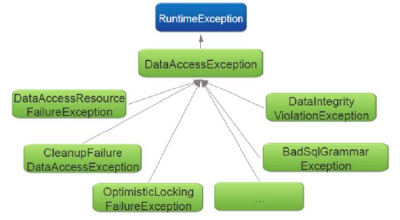
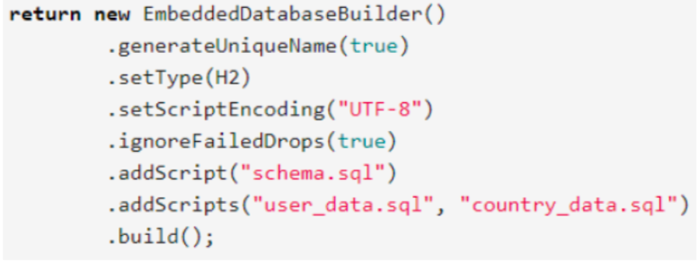
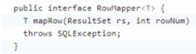
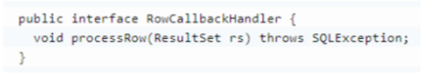
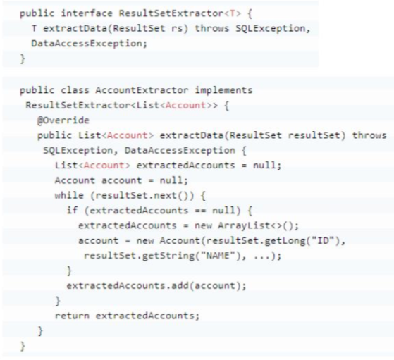
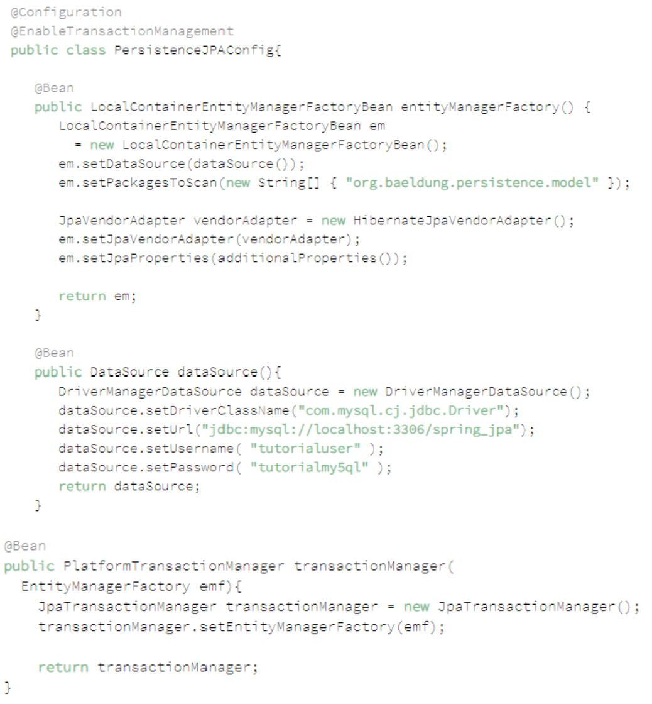
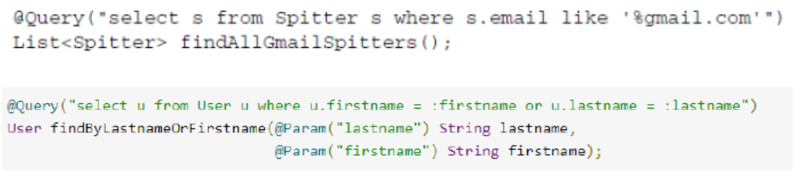

# Spring Certification Study Notes
## Data Management
### What is the difference between checked and unchecked exceptions?

Checked exceptions are exceptions that are checked at compile time – that fact enforces developer to handle by try catch or propagated via method to caller. Unchecked exceptions do not require try/catch.

### Why does Spring prefer unchecked exceptions?
Checked exceptions forces developers to either implement error handling in the form of try- catch blocks or to declare exceptions thrown by underlying methods in the method signature. This can result in cluttered code and/or unnecessary coupling to the underlying methods.
In case of SQLException, it means that something went wrong while trying to access database and there is little to nothing you can do about it.

### What is the data access exception hierarchy?
The data access exception hierarchy is the DataAccessException class and all of its subclasses in the Spring Framework. All the exceptions in this exception hierarchy are unchecked.
 
 
## How do you configure a DataSource in Spring? Which bean is very useful for development/test databases?
### Configuring data source using JDBC driver
- DriverManagerDataSource: It always creates a new connection for every connection request
- SimpleDriverDataSource: It is similar to the DriverManagerDataSource except that it works with the JDBC driver directly
- SingleConnectionDataSource: It returns the same connection for every connection request, but it is not a pooled data source
- EmbeddedDatabaseBuilder: **Very useful in development/test databases.** Used to create an embedded database using Java Config like in the following example


### What is the Template design pattern and what is the JDBC template?
This pattern defines the outline or skeleton of an algorithm, and leaves the details to specific implementations later. This pattern hides away large amounts of boilerplate code.

Spring provides many template classes, such as **JdbcTemplate, JmsTemplate, RestTemplate, and WebServiceTemplate.**

Spring implements this pattern to access data from a database. In a database, or any other technology, there are some steps that are always common, such as **establishing a connection to the database, handling transactions, handling exceptions, and some clean up actions which are required for each data access process.** But there are also some steps which are not fixed, but depend on the application's requirement.

### What is JDBC template?
The Spring JdbcTemplate class is a Spring class that simplifies the use of JDBC by implementing common workflows for querying, updating, statement execution etc. Spring's JdbcTemplate, in a nutshell, is responsible for the following:

- Acquisition of the connection
- Participation in the transaction
- Execution of the statement
- Processing of the result set
- Handling any exceptions
- Release of the connection

### What is a callback?
A callback is code or reference to a piece of code that is passed as an argument to a method that, at some point during the execution of the methods, will call the code passed as an argument. In Java a callback can be a reference to a Java object that implements a certain interface or, starting with Java 8, a lambda expression.

### What are the three JdbcTemplate callback interfaces that can be used with queries? What is each used for?
#### RowMapper
Spring provides a RowMapper interface for mapping a single row of a ResultSet to an object. It can be used for both single and multiple row queries.



### RowCallbackHandler
Allows for processing rows in a result set one by one typically accumulating some type of result. Row callback handlers are typically stateful, storing the accumulated result in an instance variable. Note that the processRow method in this interface has a void return type.


### ResultSetExtractor
Spring provides a ResultSetExtractor interface for processing an entire ResultSet at once. Here, you are responsible for iterating the ResultSet, for example, for mapping the entire ResultSet to a single object.


### Can you execute a plain SQL statement with the JDBC template?
Plain SQL statements can be executed using the JdbcTemplate class. The following methods accept one or more SQL strings as parameters:

- batchUpdate
- execute
- query
- queryForList
- queryForMap
- queryForObject 
- queryForRowSet 
- update

### When does the JDBC template acquire (and release) a connection - for every method called or once per template? Why?
JdbcTemplate acquire and release a database connection for every method called. 

That is, a connection is acquired immediately before executing the operation at hand and released immediately after the operation has completed, be it successfully or with an exception thrown. 

The reason for this is to avoid holding on to resources (database connections) longer than necessary and creating as few database connections as possible, since creating connections can be a potentially expensive operation. 

When database connection pooling is used connections are returned to the pool for others to use.

### How does the JdbcTemplate support generic queries? How does it return objects and lists/maps of objects?
- queryForObject(..): This is a query for simple java types (int, long, String, Date ...) and for custom domain objects.
- queryForMap(..): This is used when expecting a single row. JdbcTemplate returns each row of a ResultSet as a Map.
- queryForList(..): This is used when expecting multiple rows.
The queryForList methods all return a list containing the resulting rows of the query and comes in two flavors:
 - One type that takes an element type as parameter. This type of queryForList method returns a list containing objects of the type specified by the element type parameter.
 - The other type that does not have any element type parameter. This type of queryForList method returns a list containing maps with string keys and Object values.
  
     Each map contains a row of the query result with the column names as keys and the column values as values in the map.

### What is a transaction? What is the difference between a local and a global transaction?
Transaction is an indivisible unit of work.

- **Local transactions** are transactions associated with one single resource, such as one single database or a queue of a message broker, but not both in one and the same transaction. 
- **Global transaction** is application server managed and spreads across many components/ technologies. 
 - For global transactions consider the case that a record must be persisted in a database ONLY if some message is sent to a queue and processed – if the later fail the transaction must be rolled back.
 - **Global transactions requires a dedicated transaction manager.**

### Declarative transaction demarcation and implementation
Declarative deals with adding some AOP related to transactions to the methods annotated with @Transactional or that have some tx-advices defined by XML. Spring provides a consistent model for handling transactions in a Spring application, and provides an interface PlatformTransactionManager to hide the implementation details:

- DataSourceTransactionManager 
- HibernateTransactionManager
- JpaTransactionManager
- JtaTransactionManager
- WebLogicJtaTransactionManager
- WebSphereUowTransactionManager

#### Programmatic transaction demarcation and implementation
Spring allows you to implement and demarcate transactions programmatically in the application by using the TransactionTemplate and a PlatformTransactionManager implementation directly.

### How are you going to define a transaction in Spring?
The following two steps are all required to use Spring transaction management in a Spring application:

1. Declare a PlatformTransactionManager bean
2. Declare transaction demarcation

If using annotation-driven transaction management, then apply the
**@EnableTransactionManagement** annotation to exactly one **@Configuration** class in the application. **@EnableTransactionManagement** annotation defines a Bean Post-Processor in the application, and it proxies **@Transactional** beans.

If you use this annotation with a non-public method, such as protected, private, or package- visible, no error or exception is thrown, but this annotated method does not show the transactional behavior.

### What does @Transactional do? What is the PlatformTransactionManager?
**@Transactional**
The **@Transactional** annotation is used for declarative transaction management and can be applied to methods and classes.
 
The following can be configured in the @Transactional annotation:

- isolation. The degree to which this transaction is isolated from the work of other
transactions. For example, can this transaction see uncommitted writes from other
transactions?
- noRollbackFor. Exception class(es) that never are to cause a transaction rollback.
- noRollbackForClassName. Names of exception class(es) that never are to cause a
transaction rollback
- propagation. For example, code can continue running in the existing transaction (the
common case); or the existing transaction can be suspended and a new transaction
created
- readOnly. A read-only transaction can be used when your code reads but does not
modify data. Read-only transactions can be a useful optimization in some cases, such
as when you are using Hibernate
- rollbackFor. Exception class(es) that are to cause a transaction rollback
- rollbackForClassName. Name of exception class(es) that are to cause a transaction
rollback
- timeout. How long this transaction runs before timing out and being rolled back
automatically by the underlying transaction infrastructure
- transactionManager. Name of transaction manager Spring bean
What is the PlatformTransactionManager?
PlatformTransactionManager is the base interface for all transaction managers that can be used in the Spring framework’s transaction infrastructure.
The PlatformTransactionManager interface contain the following methods:

#### What is the PlatformTransactionManager?
**PlatformTransactionManager** is the base interface for all transaction managers that can be used in the Spring framework’s transaction infrastructure.
The **PlatformTransactionManager
[-]** interface contain the following methods:

- void commit(TransactionStatus). Commits or rolls back the transaction related to the TransactionStatus object transaction depending on its status
- void rollback(TransactionStatus). Rolls back the transaction related to the TransactionStatus object
- TransactionStatus getTransaction(TransactionDefinition). Creates a new transaction and return it or return the currently active transaction, depending on how transaction propagation has been configured
 
### Is the JDBC template able to participate in an existing transaction?
Yes, the **JdbcTemplate** is able to participate in existing transactions both when declarative and programmatic transaction management is used. This is accomplished by wrapping the **DataSource** using a **TransactionAwareDataSourceProxy**.

### What is a transaction isolation level? How many do we have and how are they ordered?
Transaction isolation level is the level of one isolation of one transaction from another. Transaction level is defined from perspective of 3 characteristics:

- Dirty reads – one transaction can read uncommitted data from other transaction
- Non-repeatable read – occurs when a second transactions reads the same row from first transaction at different times getting different data each time because of first
transaction committing some changes or deleting the row
- Phantom reads – occurs when the same search criteria is returning different data
because of some other transaction interfering and deleting/adding data

#### How many do we have and how are they ordered?
- Serializable = 8. Indicates that dirty reads, non-repeatable reads and phantom reads are prevented
- Repeatable reads = 4. Indicates that dirty reads and non-repeatable reads are prevented; phantom reads can occur
- Read committed = 2. Indicates that dirty reads are prevented; non-repeatable reads and phantom reads can occur
- Read uncommitted = 1. Indicates that dirty reads, non-repeatable reads and phantom reads can occur
- Default = -1 

#### Serializable
**Serializable** is the highest isolation level and involves read and write locks on data associated with the processing in the transaction as well as range-locks if there are select queries with where clauses. The locks are held until the end of the transaction.
 
#### Repeatable Reads
In the** repeatable reads** isolation level, read and write locks on data associated with the processing in the transaction are held until the end of the transaction. Range-locks are not used, so phantom reads can occur.

#### Read Committed
In the **read committed** isolation level, write locks on data associated with the processing in the transaction are held until the end of the transaction. Read locks are held, but only until the select statement with which the read lock is associated has completed.

At this isolation level, phantom reads and non-repeatable reads can occur.

#### Read Uncommitted
**Read Uncommitted** is the same as No Lock. There are no locks on the data.

### What is @EnableTransactionManagement for?
Enables Spring's annotation-driven transaction management capability. To be used on @Configuration classes.

```
@Configuration
@EnableTransactionManagement
public class AppConfig {}
```

Components registered when the **@EnableTransactionManagement** annotation is used are:

- **TransactionInterceptor**. Intercepts calls to @Transactional methods creating new
transactions as necessary etc.
- **A JDK Proxy or AspectJ advice.** This advice intercepts methods annotated with
**@Transactional (or methods that are located in a class annotated with @Transactional).**

**@EnableTransactionManagement** and <tx:annotation-driven/> only looks for **@Transactional** on beans in the same application context they are defined in. This means that, if you put annotation driven configuration in a WebApplicationContext for a DispatcherServlet, it only checks for @Transactional beans in your controllers, and not your services.


### What does transaction propagation mean?
Transaction propagation determines the way an existing transaction is used when the method is invoked.

- MANDATORY. There must be an existing transaction when the method is invoked, or an exception will be thrown
- NESTED. Executes in a nested transaction if a transaction exists, otherwise a new transaction will be created. This transaction propagation mode is not implemented in all transaction managers
- NEVER. Method is executed outside of a transaction. Throws exception if a transaction exists
- NOT_SUPPORTED. Method is executed outside of a transaction. Suspends any existing transaction
- REQUIRED (DEFAULT). Method will be executed in the current transaction. If no transaction exists, one will be created
- REQUIRES_NEW. Creates a new transaction in which the method will be executed. Suspends any existing transaction
- SUPPORTS. Method will be executed in the current transaction, if one exists, or outside of a transaction if one does not exist

### What happens if one @Transactional annotated method is callinganother @Transactional annotated method on the same objectinstance?
Self-invocation of a proxied Spring bean effectively bypasses the proxy and thus also any transaction interceptor managing transactions. Thus the second method, the method being invoked from another method in the bean, will execute in the same transaction context as the first.

### Where can the @Transactional annotation be used? What is a typical usage if you put it at class level?
The **@Transactional** annotation can be used on class and method level both in classes and interfaces. When using Spring AOP proxies, only **@Transactional** annotations on public methods will have any effect – applying the **@Transactional** annotation to protected or private methods or methods with package visibility will not cause errors but will not give the desired transaction management, as above.

Spring recommends that you **only annotate concrete classes** (and methods of concrete classes) with the **@Transactional** annotation, as opposed to annotating interfaces. **You certainly can place the @Transactional annotation on an interface** (or an interface method), **but this works only if you are using interface-based proxies.**

### What does declarative transaction management mean?
Declarative transaction management is a model build on AOP. Spring has some transactional aspects that may be used to advise methods for them to work in a transactional manner.

### What is the default rollback policy? How can you override it?
In its default configuration, the Spring Framework’s transaction infrastructure code only **marks a transaction for rollback in the case of runtime, unchecked exceptions** (instance of Runtime Exception. Errors will also – by default - result in a rollback).

The types of exceptions that will cause a rollback can be configured using the **rollbackFor** element of the **@Transactional** annotation. In addition, the types of exceptions that not are to cause rollbacks can also be configured using the **noRollbackFor** element.

### What is the default rollback policy in a JUnit test, when you use the @RunWith(SpringJUnit4ClassRunner.class) in JUnit 4 or @ExtendWith(SpringExtension.class) in JUnit 5, and annotate your @Test annotated method with @Transactional?
If a test-method annotated with **@Test** is also annotated with **@Transactional**, then the framework creates and rolls back a transaction for each test.

### Why is the term "unit of work" so important and why does JDBC AutoCommit violate this pattern?
JDBC AutoCommit will cause each individual SQL statement as to be executed in its own transaction and the transaction committed when each statement is completed. This makes it impossible to perform operations that consist of multiple SQL statements as a unit of work. **JDBC AutoCommit can be disabled by calling the setAutoCommit method with the value false on a JDBC connection.**

### What does JPA stand for - what about ORM?
- **JPA stands for Java Persistence API.**
- **ORM stands for Object-Relational Mapping** and is a technique for converting data format typically between what can be inserted into a SQL database and what can be represented by a Java object hierarchy residing in memory.

### What is the idea behind an ORM? What are benefits/disadvantages or ORM?
The technique of bridging the gap between the object model and the relational model is known as object-relational mapping. Duties of ORM:
- Data-type conversion to and from what can be stored in a database
- Maintaining relationships between objects
- Prevent the developer from having to deal with (vendor specific) SQL

### What are benefits/disadvantages or ORM?
Benefits:

- Facilitates implementing domain model pattern
- Code reduction
- Portable. Takes care of vendor specific code by itself
- Cache Management — Entities are cached in memory thereby reducing load on the
DB
- Easy extraction and/or updates of graphs
- Unified API

Disadvantages:

- Slow
- Added complexity
- Use of an ORM with legacy database tables can be difficult

### What is a PersistenceContext and what is an EntityManager. What is the relationship between both?
If there's one thing you have to understand to successfully use JPA (Java Persistence API) it's the concept of a Cache. Almost everything boils down to the Cache at one point or another. Here's a quick cheat sheet of the JPA world:

- A **Cache** is a **copy of data**, copy meaning pulled from but living outside the database.
- **Flushing** a Cache is the act of putting modified data back into the database.
- A **PersistenceContext** is essentially a **Cache**. It also tends to have it's own non-shared database connection.
- An **EntityManager** represents a **PersistenceContext**. The entity manager provides an API for managing a persistence context and interacting with the entities in the
persistence context
- An **EntityManagerFactory** creates an **EntityManager** (and therefore a
**PersistenceContext/Cache**)


**When the cache is "flushed" the data in it is sent to the
database using as many SQL updates, inserts and deletes 
as are required.**

 
With ```<persistence-unit transaction-type="RESOURCE_LOCAL">```you are responsible for creating and tracking EntityManager:

- You must use the EntityManagerFactory to get an EntityManager
- The resulting EntityManager instance is a PersistenceContext/Cache
- An EntityManagerFactory can be injected via the @PersistenceUnit annotation
only (not @PersistenceContext)

With ```<persistence-unit transaction-type="JTA">``` the container will do creating and tracking EntityManager:

- You cannot use the EntityManagerFactory to get an EntityManager
- You can only get an EntityManager supplied by the container
- **An EntityManager can be injected via the @PersistenceContext annotation only
(not @PersistenceUnit)**

### Why do you need the @Entity annotation. Where can it be placed?
JPA mapping can be done either using annotations or XML. The @Entity annotation is used to annotate classes in order to make it possible to turn instances of the class into persistent entities. Such annotated classes can be discovered at runtime using classpath scanning in order decide which entity types are to be included in a persistence unit.
**The @Entity annotation can be applied only at class level.**

### What do you need to do in Spring if you would like to work with JPA?
JPA-based applications use an implementation of EntityManagerFactory to get an instance of an EntityManager. The JPA specification defines two kinds of entity managers:

- **Application-managed.** With application-managed entity managers, the application is responsible for opening or closing entity managers and involving the entity manager in transactions. This type of entity manager is most appropriate for use in standalone applications that don’t run in a Java EE container.
- **Container-managed.** Entity managers are created and managed by a Java EE container. The application doesn’t interact with the entity manager factory at all.
Each flavor of entity manager factory is produced by a corresponding Spring factory bean:
- **LocalEntityManagerFactoryBean** produces an application-managed
EntityManagerFactory.
  
- **LocalContainerEntityManagerFactoryBean** produces a container-managed EntityManagerFactory.
Steps to start working with JPA:
- **Define EntityManagerFactory** (either Local or LocalContainer);
- **Define Adapter.** Spring comes with a handful of JPA vendor adapters to choose from:
	- EclipseLinkJpaVendorAdapter
	- HibernateJpaVendorAdapter
	- OpenJpaVendorAdapter




### Are you able to participate in a given transaction in Spring while working with JPA?
Yes, if you register TransactionManager.
The Spring JpaTransactionManager supports direct DataSource access within one and the same transaction allowing for mixing plain JDBC code that is unaware of JPA with code that use JPA.

### Which PlatformTransactionManager(s) can you use with JPA?
First, any JTA transaction manager can be used with JPA since JTA transactions are global transactions, that is they can span multiple resources such as databases, queues etc. Thus JPA persistence becomes just another of these resources that can be involved in a transaction. When using JPA with one single entity manager factory, the Spring Framework JpaTransactionManager is the recommended choice. This is also the only transaction manager that is JPA entity manager factory aware.
If the application has multiple JPA entity manager factories that are to be transactional, then a JTA transaction manager is required.

### What does @PersistenceContext do?
The @PersistenceContext annotation is applied to a instance variable of the type EntityManager or a setter method, taking a single parameter of the EntityManager type, into which an entity manager is to be injected by Application managed EntityManagerFactory. The truth is that @PersistenceContext doesn’t inject an EntityManager – at least, not exactly. Instead of giving the repository a real EntityManager, it gives a proxy to a real EntityManager.
  
That real EntityManager either is one associated with the current transaction or, if one doesn’t exist, creates a new one.

### What do you have to configure to use JPA with Spring? How does Spring Boot make this easier?
1. Configure **DataSource**
2. Configure **LocalContainerEntityManagerFactoryBean**
3. Configure **JpaVendorAdapter**
4. Configure **PlatformTransactionManager**
5. Configure **PersistenceExceptionTranslationPostProcessor** (Note that exception
translation, whether with JPA or Hibernate, isn’t mandatory. If you’d prefer that your repository throw JPA-specific or Hibernate-specific exceptions, you’re welcome to forgo PersistenceExceptionTranslationPostProcessor and let the native exceptions flow freely.
6. Configure **PersistenceAnnotationBeanPostProcessor** (if you want to use @PersistenceUnit and @PersistenceContext)
**Spring boot has Autoconfigure class called JpaBaseConfiguration, which create this out of the box.
**
### What is an "instant repository"? (hint: recall Spring Data)
An instant repository, also known as a Spring Data repository, is a repository that need no implementation and that supports the basic CRUD (create, read, update and delete) operations. Such a repository is declared as an interface that typically extend the Repository interface or an interface extending the Repository interface. Annotating an interface with **@RepositoryDefinition** will cause the same behaviour as extending Repository.

### How do you define an “instant” repository? Why is it an interface not a class?

**You have 2 options:**

- Extend some implementation of Repository interface.
- Annotate the future instant repository class with @RepositoryDefinition

Repositories are defined as interfaces in order for Spring Data to be able to use the JDK dynamic proxy mechanism to create the proxy objects that intercept calls to repositories.
With the Spring Data repository interfaces in place, annotate a Spring configuration class with an annotation **@EnableJpaRepositories** to enable the discovery and creation of repositories.

### What is the naming convention for finder methods?
The naming convention of these finder methods are:

- If a count is supplied after the “First”, for example “findFirst10”, then the count number of entities first found will be the result
- optional comparison operator enables creation of finder methods that selects a range of entities. Examples: LessThan, GreaterThan

### How are Spring Data repositories implemented by Spring at runtime?

For a Spring Data repository a JDK dynamic proxy is created which intercepts all calls to the repository. The default behavior is to route calls to the default repository implementation, which in Spring Data JPA is the SimpleJpaRepository class.

### What is @Query used for?
The @Query annotation allows for specifying a query to be used with a Spring Data JPA repository method.
