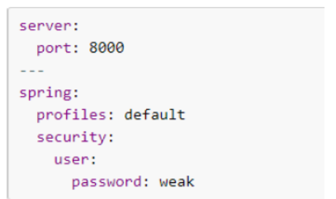
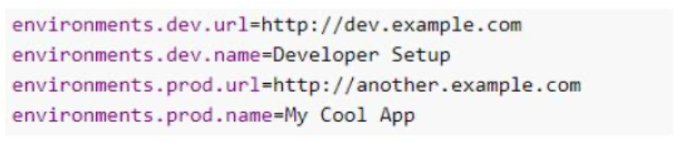
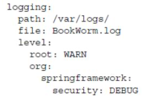

## What is Spring Boot?
Spring Boot is a set of preconfigured modules that works on top of Spring Framework and simplifies configuring a Spring application.

Some of the more central modules are:

- Spring-boot-dependencies. Contains versions of dependencies
- Spring-boot-starter-parent. Parent pom.xml
- Spring-boot-starters. Parent for all the Spring-Boot starter modules
- Spring-boot-autoconfigure. Contains the autoconfigure modules for the starters.
- Spring-boot-actuator. Allows for monitoring and managing of application created

## What are the advantages of using Spring Boot?
- Automatic configuration of “sensible defaults” reducing boilerplate configuration
- Allows for easy customization when the defaults no longer suffices
- A Spring Boot project can produce an executable stand-alone JAR-file
- Provides a set of managed dependencies that have been verified to work together
- Integrated web containers that allow for easy testing

## Why is it “opinionated”?
It makes assumptions on what you need based on dependencies from the classpath. 

Convention over configuration - pre-configures Spring app by reasonable defaults, which can be overridden.

## How does it work? How does it know what to configure?
Spring Boot detects the dependencies available on the classpath and configures Spring beans accordingly. 

There are a number of annotations, examples are: 

- @ConditionalOnClass
- @ConditionalOnBean
- @ConditionalOnMissingBean
- @ConditionalOnMissingClass

These annotations allow for applying conditions to Spring configuration classes or Spring bean declaration methods in such classes. 

### Examples:
   
- A Spring bean is to be created only if a certain dependency is available on the classpath. Use @ConditionalOnClass and supply a class contained in the dependency in question.
- A Spring bean is to be created only if there is no bean of a certain type or with a certain name created. Use @ConditionalOnMissingBean and specify name or type of bean to check.

## What things affect what Spring Boot sets up?
There are a number of condition annotations in Spring Boot each of which can be used to control the creation of Spring beans. 

The following is a list of the condition annotations in Spring Boot (there are more):

|       Condition Annotation      |                                             Condition Factor                                            |
|:-------------------------------:|:-------------------------------------------------------------------------------------------------------:|
| @ConditionalOnClass             | Presence of class on classpath                                                                          |
| @ConditionalOnMissingClass      | Absence of class on classpath                                                                           |
| @ConditionalOnBean              | Presence of Spring bean or bean type (class)                                                            |
| @ConditionalOnMissingBean       | Absence of Spring bean or bean type (class)                                                             |
| @ConditionalOnProperty          | Presence of Spring environment property                                                                 |
| @ConditionalOnResource          | Presence of resource such as file                                                                       |
| @ConditionalOnWebApplication    | If the application is considered to be a web application, that is uses the Spring WebApplicationContext |
| @ConditionalOnNotWebApplication | If the application is not considered to be a web application|

## How are properties defined? Where is Spring Boot’s default property source?
Spring Boot uses a very particular PropertySource order that is designed to allow sensible overriding of values. Properties are considered in the following order:

1. Devtools global settings properties on your home directory (~/.spring-boot devtools.properties when devtools is active).
2. @TestPropertySource annotations on your tests.
3. @SpringBootTest#properties annotation attribute on your tests. 4. Command line arguments.
5. Properties from SPRING_APPLICATION_JSON (inline JSON embedded in an environment variable or system property).
6. ServletConfig init parameters.
7. ServletContext init parameters.
8. JNDI attributes from java:comp/env.
9. Java System properties (System.getProperties()).
10. OS environment variables.
11. A RandomValuePropertySource that has properties only in random.*.
12. Profile-specific application properties outside of your packaged jar (application- {profile}.properties and YAML variants).
13. Profile-specific application properties packaged inside your jar (application- {profile}.properties and YAML variants).
14. Application properties outside of your packaged jar (application.properties and YAML variants).
15. Application properties packaged inside your jar (application.properties and YAML variants).
16. @PropertySource annotations on your @Configuration classes.
17. Default properties (specified by setting SpringApplication.setDefaultProperties).
Also, I’ve found that if you have both application.properties and application.yml side by side at the same level of precedence, properties in application.yml will override those in application.properties.

## Would you recognize common Spring Boot annotations and configuration properties if you saw them in the exam?

**@SpringBootApplication** annotation can be used to enable three features, that is:

- **@EnableAutoConfiguration:** enable Spring Boot’s auto-configuration mechanism
- **@ComponentScan:** enable **@Component** scan on the package where the application is located (see best practices)
- **@Configuration:** register extra beans in the context or import additional configuration classes

### Other common Spring Boot Annotations:
- **@EnableConfigurationProperties.** Enables support for Spring beans annotated with **@ConfigurationProperties**
- **@ConfigurationProperties**. Allows for binding a selected group of configuration properties to a class
- **@WebMvcTest**. Annotation used in Spring MVC tests testing only Spring MVC components.
- **@SpringBootTest**
- **@DataJpaTest**

## What is the difference between an embedded container and a WAR?
Embedded container is a server that comes with the resulting application whereas WAR is an archive that can be deployed on an external container.

Servlet containers are great to manage multiple applications on a single host but don't seem very useful to manage just one single application. 

With cloud environments, a single application per virtual machine seems preferable and more common. 

Modern frameworks want to be cloud compatible, therefore the shift to embedded servers.

## What embedded containers does Spring Boot support?
Spring Boot includes support for embedded Tomcat, Jetty, and Undertow servers.

## What does @EnableAutoConfiguration do?
The **@EnableAutoConfiguration** annotation enables Spring Boot auto-configuration. Spring Boot auto-configuration attempts to create and configure Spring beans based on the dependencies available on the class-path to allow developers to quickly get started with different technologies in a Spring Boot application and reducing boilerplate code and configuration.

## What about @SpringBootApplication?
**@SpringBootApplication** does 3 things:

- turns on autoconfig (**@EnableAutoConfiguration**)
- enables auto-scanning (**@ComponentScan**)
- defines a configuration class (**@Configuration**)

##Does Spring Boot do component scanning? Where does it look by default?
If it’s annotated with @SpringBootApplication. The **@SpringBootApplication** annotation is often placed on your main class, and it implicitly defines a base “search package” for certain items.

## What is a Spring Boot starter POM? Why is it useful?
Spring Boot Starters are a set of convenient dependency descriptors that you can include in your application. You get a one-stop-shop for all the Spring and related technology that you need without having to hunt through sample code and copy paste loads of dependency descriptors. 

For example, if you want to get started using Spring and JPA for database access just include the **spring-boot-starter-data-jpa** dependency in your project, and you are good to go.

The starters contain a lot of the dependencies that you need to get a project up and running quickly and with a consistent, supported set of managed transitive dependencies.

## Spring Boot supports both Java properties and YML files. Would you recognize and understand them if you saw them?
Java properties files come in application.properties file; YAML come in application.yml. 

### YML:

### Properties:

## Can you control logging with Spring Boot? How?
### Controlling Log Levels
By default, messages written with the **ERROR**, **WARN** and **INFO** levels will be output in a Spring Boot application. To enable **DEBUG** or **TRACE** logging for the entire application, use the --debug or --trace flags or set the properties debug=true or trace=true in the application.properties file.

Log levels can be controlled at a finer granularity using the application.properties file:

## File Output
By default, Spring Boot logs only to the console and does not write log files. If you want to write log files in addition to the console output, you need to set a logging.file or logging.path property (for example, in your application.properties).

## Color-coding of Log Levels
In consoles that support ANSI, messages of different log levels can be color-coded to improve readability. 

This can be accomplished as shown in the following example:

Suppose that you want to write the log entries to a file named BookWorm.log at /var/logs/. The logging.path and logging.file properties can help with that:
./StudyNoteImages/