## MVC is an abbreviation for a design pattern. What does it stand for and what is the idea behind it?
### Model View Controller pattern (MVC pattern).
The MVC pattern divides the system into three kinds of components. Each component in the system has specific responsibilities. 

Let's see these three components of this pattern:

- Model: The model in the MVC pattern is responsible for maintaining data for the view so that it can be rendered in any view template.
- View: The view in the MVC pattern is responsible for rendering the model to a readable format to the user. There are several technologies that provide the view, such as JSP, JSF page, PDF, XML, and so on.
- Controller: This is an actual actionable component in the MVC pattern. In Software, the controller code controls the interaction between the view and model. Interactions such as form submission or clicking a link are part of the controller in an enterprise application.

**MVC pattern is all about separation of concerns.**

User interacts with the Controller component through the View component, and the Controller component triggers the actual action to prepare the Model component. That Model component propagates the changes to the View, and finally, the View component renders the model in front of the User.

### Advantages:
- Reuse of model and controllers with different views
- Reduced coupling between the model, view and controller
- Separation of concerns

## Do you need spring-mvc.jar in your classpath or is it part of spring- core?
You need spring-mvc.jar in your classpath. It is not part of the spring-core. However, springmvc includes spring-core.

## What is the DispatcherServlet and what is it used for?
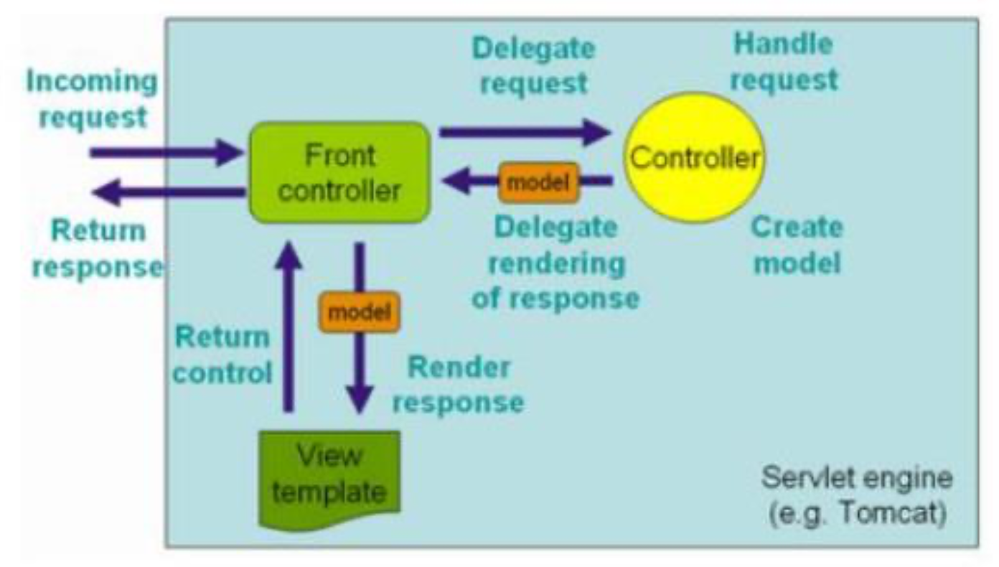

Spring MVC, is designed around the front controller pattern where a central Servlet, the **DispatcherServlet**, provides a shared algorithm for request processing, while actual work is performed by configurable delegate components (**@Controller**).

### The duties of the DispatcherServlet consist of:

- Receives requests and delegates them to registered handlers
- Resolves views by mapping view-names to View instances
- Resolves exceptions that occur during handler mapping or execution

The front controller design pattern allows for centralizing matters, like security and error handling, that are to be applied to the entire application.

A Spring web application may define multiple dispatcher servlets, each of which has its own namespace, its own Spring application context and its own set of mappings and handlers.

## Request Processing Lifecycle
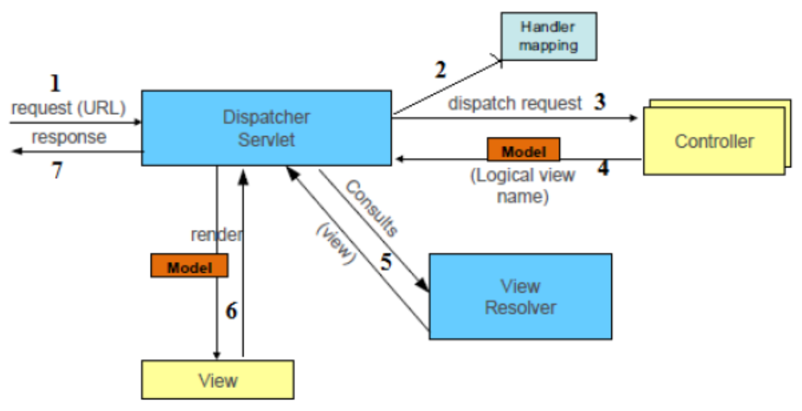

1. Request lands at Spring's DispatcherServlet
2. DispatcherServlet delegates that request to the Spring MVC controller, that is, application controller. Spring's DispatcherServlet takes care of the handler mappings configured in the web application. Handler mapping decides the particular controller by using the URL and request parameters.
3. Once a particular application controller is decided DispatcherServlet dispatches that request to the selected controller.
4. Spring MVC's controller executes the business logic by using business services of the application and it creates the model which wraps the information to be carried back to the user. Spring MVC's controller also returns a logic view name along with the model.
5. According to the configured ViewResolver, the Dispatcher Servlet resolves the actual view name instead of the logic view name.
6. Spring MVC's DispatcherServlet renders the model to the view.
7. Finally, that information creates a response, and returns it to the user's browser by Dispatcher Servlet.

## Is the DispatcherServlet instantiated via an application context?
The DispatcherServlet is not instantiated via an application context. It is instantiated before any application context is created.
 
In a Servlet 3.0 environment, the container looks for any classes in the classpath that implement the javax.servlet.ServletContainerInitializer interface; if any are found, they’re used to configure the servlet container.

Spring supplies an implementation of that interface called SpringServletContainerInitializer that, in turn, seeks out any classes that implement WebApplicationInitializer and delegates to them for configuration.

Spring 3.2 introduced a convenient base implementation of WebApplicationInitializer called **AbstractAnnotationConfigDispatcherServletInitializer**. **AbstractAnnotationConfigDispatcherServletInitializer** creates both a **DispatcherServlet** and a **ContextLoaderListener**.

### DispatcherServlet can be instantiated in 2 different ways and in both it is initialized by the servlet container:

- XML: web.xml is the root file of any web application, placed in the WEB-INF directory. It has a servlet specification, and contains all the servlet configuration to be bootstrapped.
- Java: by extending **AbstractAnnotationConfigDispatcherServletInitializer**.

## What is a web application context? What extra scopes does it offer?

Web application context, specified by the **WebApplicationContext** interface, is a Spring application context for a web applications. **It has all the properties of a regular Spring application context, given that the WebApplicationContext interface extends the ApplicationContext interface, and adds a method for retrieving the standard Servlet API ServletContext for the web application.**
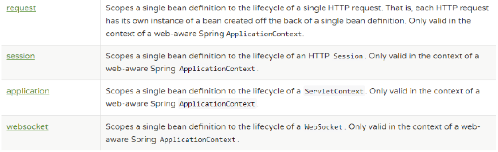

## What is the @Controller annotation used for?
The **@Controller** annotation is a specialization of the **@Component** annotation. 

In a web application, the controllers work between the web layer and the core application layer. In the Spring MVC framework, controllers are also more like POJO classes with methods; these methods are known as handlers, because these are annotated with the **@RequestMapping** annotation.

You could also use the **@Component** annotation instead of **@Controller** to create Spring beans in a web application, but in this case, **that bean does not have the capability of the Spring MVC framework such as exception handling at web layer, handler mapping, and so on.**

## How is an incoming request mapped to a controller and mapped to a method?

### When a request is issued to the application:

- DispatcherServlet of the application receives the request.
- DispatcherServlet maps the request to a method in a controller.
- DispatcherServlet holds a list of classes implementing the HandlerMapping interface.
- DispatcherServlet dispatches the request to the controller.
- The method in the controller is executed.

```
/articles/new 
Dispatcher servlet: /
Controller: /articles 
Method: /new
```

## What is the difference between @RequestMapping and @GetMapping?
**@GetMapping** is a composed annotation that acts as a shortcut for **@RequestMapping(method = RequestMethod.GET)**.

## What is @RequestParam used for?
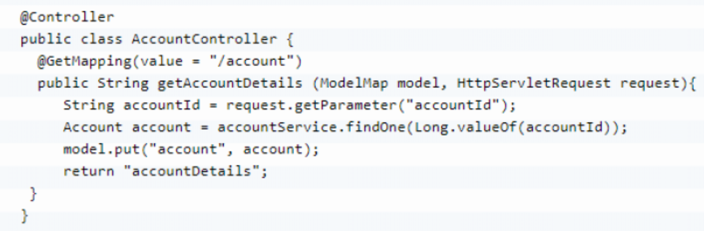
The **@RequestParam** annotation is used to annotate parameters to handler methods in order to bind request parameters to method parameters.

### Assume there is a controller method with the following signature and annotations:
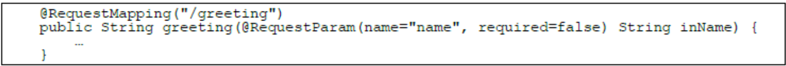
If then a request is sent to the URL http://localhost:8080/greeting?name=Ivan then the inName method parameter will contain the string “Ivan”.

## What are the differences between @RequestParam and @PathVariable?
Spring MVC allows you to pass parameters in the URI instead of passing them through request parameters. 

The passed values can be extracted from the request URLs. It is based on URI templates. 

It allows clean URLs without request parameters. 

The following is an example:
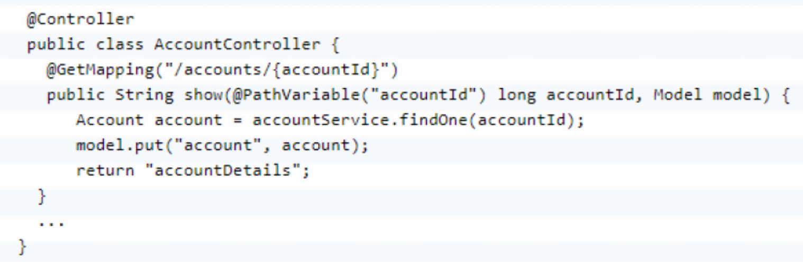
### Difference
The difference between the **@RequestParam** annotation and the **@PathVariable** annotation is that they map different parts of request URLs to handler method arguments.

## What are some of the parameter types for a controller method?
 
Controller method arguments of a type not included in the table below will as default be handled as if annotated with **@RequestParam** if the type is a simple type or handled as if annotated with **@ModelAttribute** otherwise.
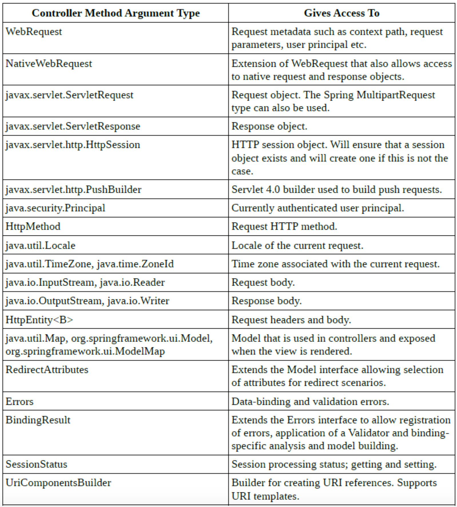

## What other annotations might you use on a controller method parameter? (You can ignore form-handling annotations for this exam)
The following table lists annotations that can be applied to arguments of controller methods.

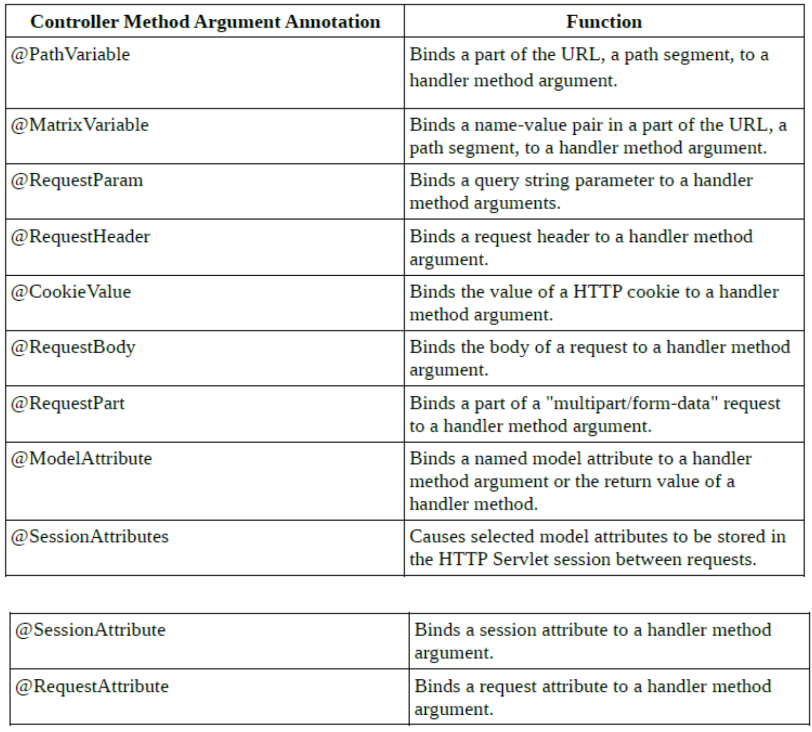

## What are some of the valid return types of a controller method?
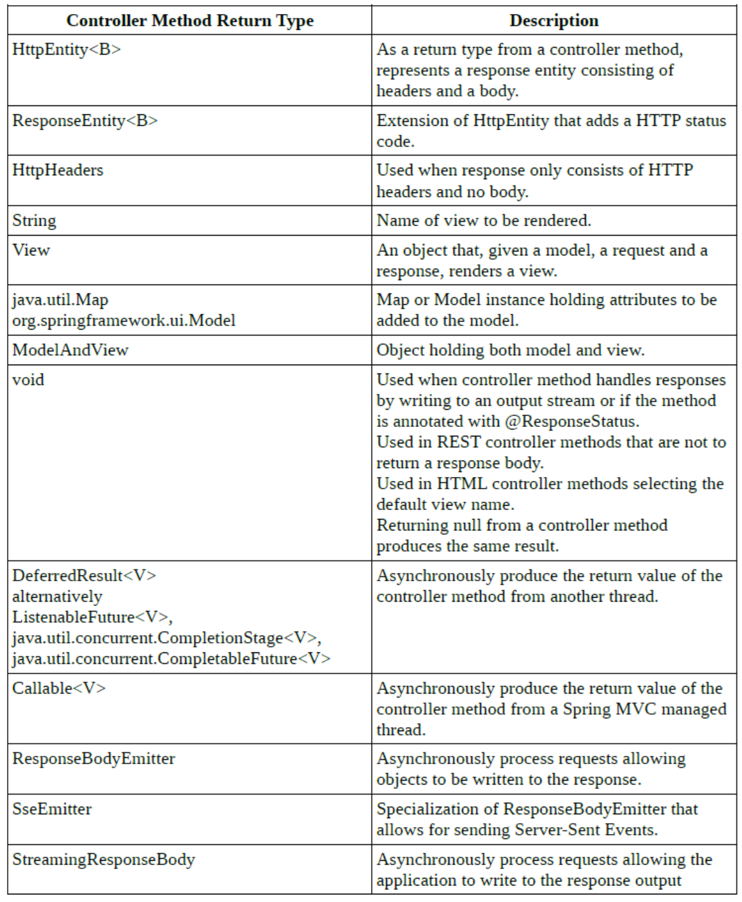

### Annotations which can be applied to controller methods that affect the result returned:
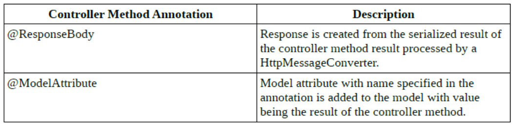

## What is a View and what's the idea behind supporting different types of View?
View is responsible for presenting the data of the application to the user. The user interacts with the view.

Spring MVC provides several view resolvers to support multiple view technologies, such as JSP, Velocity, FreeMarker, JSF, Tiles, Thymeleaf, and so on.

The View interface’s job is to take the model, as well as the servlet request and response objects, and render output into the response.
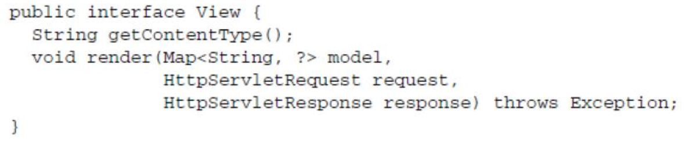

## How is the right View chosen when it comes to the rendering phase?
The dispatcher servlet holds a list of view resolvers which, depending on how the dispatcher servlet is configured, will contain one or all Spring beans that implement the ViewResolver interface. 

As part of the request-processing process, when a ModelAndView is to be rendered and there is a view name available from the ModelAndView, then each ViewResolver known to the dispatcher servlet is asked to resolve the named view until there is a resolve that succeeds. If the view-name cannot be resolved, then an exception will be thrown, otherwise the view will be rendered.

If there is no view-name available from the ModelAndView object, then the dispatcher servlet assumes there is a View available from the ModelAndView.

### View Resolution Sequence

1. Controller returns logical view name to DispatcherServlet
2. ViewResolvers are asked in sequence (based on their Order)
3. If ViewResolver matches the logical view name then returns which View should be used to render the output. If not, it returns null and the chain continues to the next ViewResolver
4. Dispatcher Servlet passes the model to the Resolved View and it renders the output

## What is the Model?
An instance of an object that implements the Model interface from the Spring framework is a collection of key-value pairs. 

The contents of the model represents the state of the application and contains information that will be used when rendering the view. The value-objects contained in the model may also contain business logic implemented in the classes instantiated to create those objects.

## Why do you have access to the model in your View? Where does it come from?
When rendering a view, information to display is taken from the model. For example, if the current view in the application is to display customer information then the view may refer to keys such as customerFirstName, customerLastName, customerStreet, customerCity etc. 

Values are retrieved from the model by requesting a value for a certain key.

The model is passed as a parameter to the view when the dispatcher servlet asks the selected view to render itself as part of processing a request.

## What is the purpose of the session scope?
A session-scoped Spring bean is a bean which exists for the lifetime of a HTTP session. This enables creating, for instance, a session-scoped Spring bean that contains a shopping cart. The bean instance will remain the same during all requests the user makes within one and the same HTTP session.

## What is the default scope in the web context?
In any context the default bean scope is singleton.

## Why are controllers testable artifacts?
Spring MVC controllers can be implemented using plain Java classes annotated with @Controller that do no need to extend any base classes nor implement any particular interfaces. This enables simple instantiation of controllers in tests that can then test the controller in isolation.

However, when writing such a unit test, much remains untested: for example, request mappings, data binding, type conversion, validation, and much more. Furthermore, other controller methods such as @InitBinder, @ModelAttribute, and @ExceptionHandler may also be invoked as part of the request processing lifecycle.

The goal of Spring MVC Test is to provide an effective way to test controllers by performing requests and generating responses through the actual DispatcherServlet.

Spring MVC Test builds on the familiar “mock” implementations of the Servlet API available in the spring-test module. This allows performing requests and generating responses without the need for running in a Servlet container.

## What does a ViewResolver do?
The controller returns the model to the front controller along with the logical view name. The front controller resolves to the actual view by using the configured view resolver. You have to configure the view resolver according to the view technology that you use in your web application. DispatcherServlet consults with the configured view resolver, and resolves the physical path of the view.
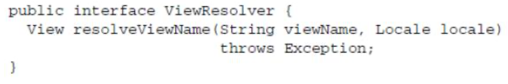