## What are authentication and authorization? Which must come first?
The short explanation of authentication is that it is the process of verifying that, for instance, a user of a computer system is who he/she claims to be. In Spring Security, the authentication process consists of the following steps quoted from the Spring Security reference:

- The username and password are obtained and combined into an instance of UsernamePasswordAuthenticationToken (an instance of the Authentication interface).
- The token is passed to an instance of AuthenticationManager for validation.
- The AuthenticationManager returns a fully populated Authentication instance on successful authentication.
- The security context is established by calling
SecurityContextHolder.getContext().setAuthentication(...), passing in the returned authentication object.

## Authorization
Authorization is the process of determining that a user is permitted to do something that the user is attempting to do. Authorization is the process of specifying access rights to resources. Authorization typically involves the following two separate aspects that combine to describe the accessibility of the secured system:

- The first is the mapping of an authenticated principal to one or more authorities (often called roles);
- The second is the assignment of authority checks to secured resources of the system.

## Which must come first?
Unless there is some type of authorization that specifies what resources and/or functions that can be accessed by anonymous users, authentication must always come before authorization.

## Is security a cross cutting concern? How is it implemented internally?
Short answer: Yes, security is a cross cutting concern.

Security is a function of an application that is not immediately associated with the business logic of the application – it is a secondary or supporting function.

## How is it implemented internally?

- Using a Spring AOP proxy that inherits from the AbstractSecurityInterceptor class. Applied to method invocation authorization on objects secured with Spring Security.
- Spring Security’s web infrastructure is based entirely on servlet filters.

The following figure shows an overview of the Spring Security web infrastructure:
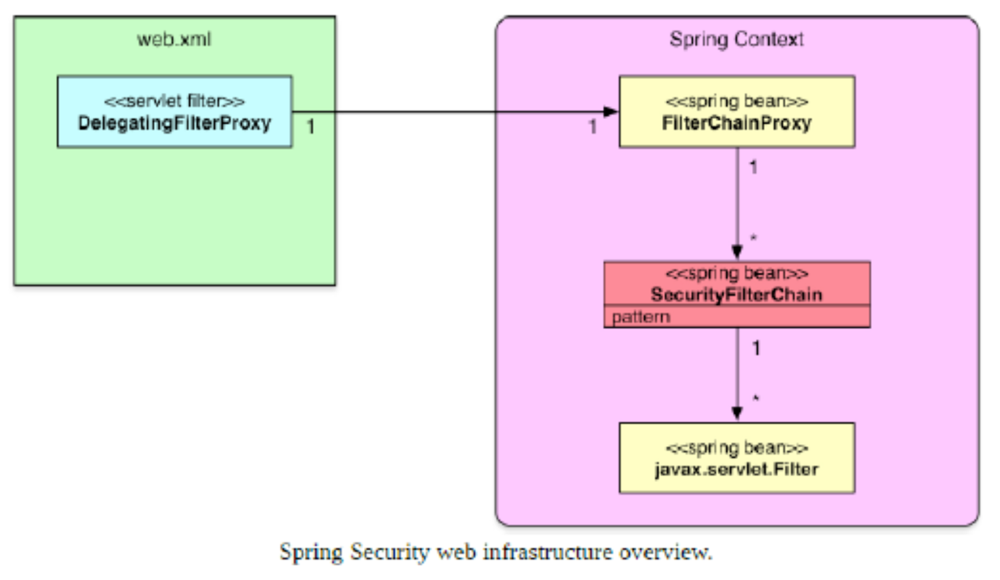

1. First of all a servlet filter of the type DelegatingFilterProxy is configured. 

2. The DelegatingFilterProxy delegates to a FilterChainProxy. 

3. The FilterChainProxy is defined as a Spring bean and takes one or more SecurityFilterChain instances as constructor parameter(s). 

4. A SecurityFilterChain associates a request URL pattern with a list of (security) filters.

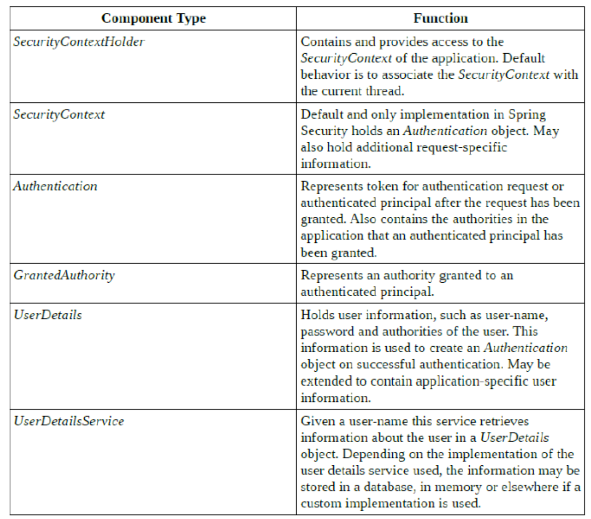

## What is the delegating filter proxy?
The o.s.web.filter.DelegatingFilterProxy class implements the javax.servlet.Filter interface and thus is a servlet filter. 

DelegatingFilterProxy is a special servlet filter that, by itself, doesn’t do much. Instead, it delegates all work to a Spring bean from the ApplicationContext root, which must implement javax.servlet.Filter. 

Since by default the bean is looked up by name, using the <filter-name> value, we must ensure we use springSecurityFilterChain as the value of <filter- name>. 

The pseudocode for how o.s.web.filter.DelegatingFilterProxy works for our web.xml file can be found in the following code snippet:
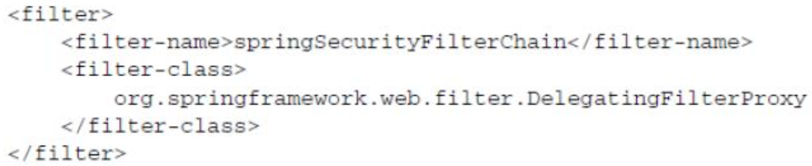
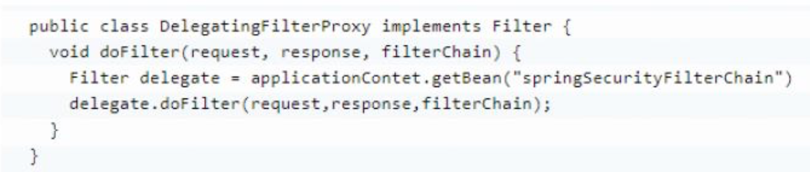

## What is the security filter chain?
The security filter chain implements the SecurityFilterChain interface and the only implementation provided by Spring Security is the DefaultSecurityFilterChain class. 

The constructor of the DefaultSecurityFilterChain class takes a variable number of parameters, the first always being a request matcher. The remaining parameters are all filters which implements the javax.servlet.Filter interface. 

The order of the filters in a security filter chain is important – filters must be declared in the following order (filters may be omitted if not needed):

- ChannelProcessingFilter
- SecurityContextPersistenceFilter
- ConcurrentSessionFilter
- Any authentication filter. Such as UsernamePasswordAuthenticationFilter,
CasAuthenticationFilter, BasicAuthenticationFilter
- SecurityContextHolderAwareRequestFilter
- JaasApiIntegrationFilter
- RememberMeAuthenticationFilter
- AnonymousAuthenticationFilter
- ExceptionTranslationFilter
- FilterSecurityInterceptor

## What is a security context?
The most fundamental object is **SecurityContextHolder**. This is where we store details of the present security context of the application, which includes details of the principal currently using the application. By default the **SecurityContextHolder** uses a **ThreadLocal** to store these details, which means that the security context is always available to methods in the same thread of execution, even if the security context is not explicitly passed around as an argument to those methods.
SecurityContextHolder.getContext().
 
The object returned by the call to **getContext()** is an instance of the SecurityContext interface. Taking a look at the SecurityContext interface, which defines the minimum security information associated with a thread of execution, there are two methods; one for setting and one for retrieving an object that implements the Authentication interface.

The Authentication interface defines the properties of an object that represents a security token for:

- A collection of the authorities granted to the principal
- The credentials used to authenticate a user. This can be a login name and a password that has been verified to match
- Details Additional information, may be application specific or null if not used.
- Principal
- Authenticated flag A boolean indicating whether the principal has been successfully authenticated

**UserDetails** is not used for security purposes, it is just a "user info" bean. Spring Security uses **Authentication** instances. So **Authentication** instance will usually have only the information needed to let users log in (usernames, credentials and roles, basically). 

**UserDetails** is more generic, and can include anything related to user management (such as contact information, account information, photographs, whatever).

**Typically, you will have an Authentication instance backed by a UserDetails instance.**

## Why do you need the intercept-url?
<intercept-url/> from <http/> is used used to specify an URL pattern in the application and information deciding who will be able to access the resource(s) which URLs match the URL pattern.

## In which order do you have to write multiple intercept-url's?
Multiple <intercept-url> elements may be defined and they will be evaluated in the order in which they are defined. 

**When an <intercept-url> element with a matching pattern is found, evaluation stops.** 

**It is therefore recommended to define more <intercept-url> elements with more specific pattern earlier and more general patterns later.**

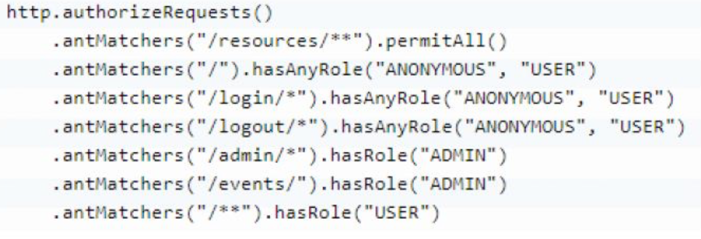

The first antMatchers() method states that Spring Security should ignore any URL that starts with /resources/, and the second antMatchers() method states that any other request will be processed by it.

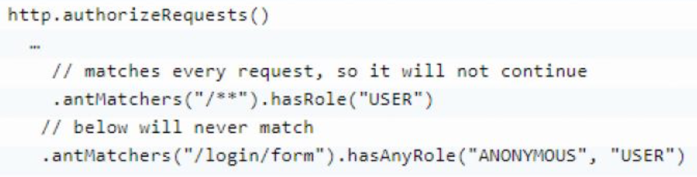

## What does the ** pattern in an antMatcher or mvcMatcher do?
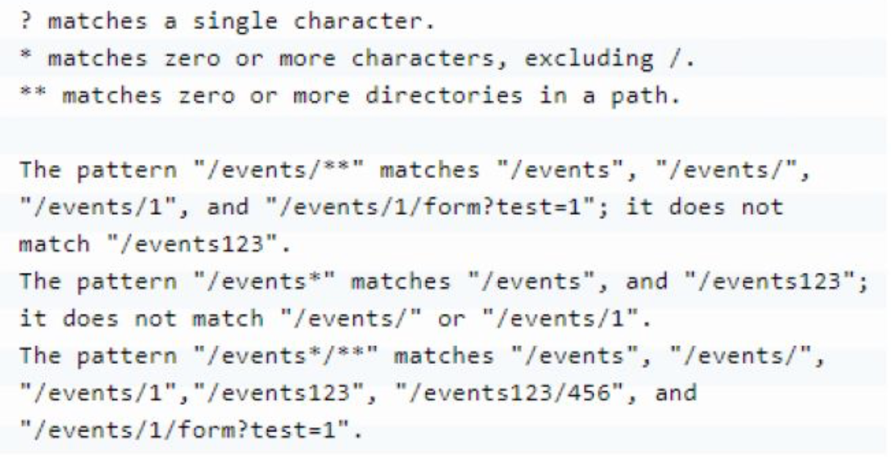
### There are two wildcards that can be used in URL patterns: 
```*```
Matches any path on the level at which the wildcard occur. Example: /services/* matches /services/users and /services/orders but not /services/orders/123/items.

```**```
Matches any path on the level at the wildcard occurs and all levels below. If only /** or ** then will match any request. Example: /services/** matches /services, /services/, /services/users and /services/orders and also /services/orders/123/items etc.

## Why is an mvcMatcher more secure than an antMatcher?
As an example antMatchers("/services") only matches the exact “/services” URL while mvcMatchers("/services") matches “/services” but also “/services/”, “/services.html” and “/services.abc”. Thus the mvcMatcher matches more than the antMatcher and is more forgiving as far as configuration mistakes are concerned. In addition, the mvcMatchers API uses the same matching rules as used by the @RequestMapping annotation. 

Finally, the mvcMatchers API is newer than the antMatchers API.

## Does Spring Security support password hashing? What is salting?
Spring Security supports password hashing. Spring Security’s **PasswordEncoder** interface is used to perform a one way transformation of a password to allow the password to be stored securely.

**PasswordEncoderFactories** has one method:
static PasswordEncoder createDelegatingPasswordEncoder() Creates a DelegatingPasswordEncoder with default mappings.
### Salting
A salt used when calculating the hash-value for a password is a sequence of random bytes that are used in combination with the cleartext password to calculate a hash-value. 

The salt is stored in cleartext alongside the password hash-value and can later be used when calculating hash- values for user-supplied passwords at login.

## Why do you need method security? What type of object is typically secured at the method level (think of its purpose not its Java type)
So far mainly the part of Spring Security that supplies security for web resources, accomplished using servlet filters, has been discussed. Spring Security also has support for security on the method level with which security constraints can be applied to individual methods in Spring beans.

Security on the method level needs to be explicitly enabled using the **@EnableGlobalMethodSecurity** annotation in regular Spring applications.

## Why do you need method security?
Method security is an additional level of security in web applications but can also be the only layer of security in applications that do not expose a web interface.

By securing both the web layer of your application and the methods behind the scenes, you can be sure that no logic will be executed unless the user is authorized.

## What type of object is typically secured at method level?
Method-level security is commonly applied to services in the service layer of an application.

## What do @PreAuthorized and @RolesAllowed do? What is the difference between them?

### Spring Security provides three different kinds of security annotations:

- Spring Security’s own **@Secured**
- JSR-250’s **@RolesAllowed**
- Expression-driven annotations, with **@PreAuthorize, @PostAuthorize, @PreFilter,**
and **@PostFilter**

The **@Secured** and **@RolesAllowed** annotations are the simplest options, restricting access based on what authorities have been granted to the user.

## @PreAuthorize
The **@PreAuthorize** annotation allows for specifying access constraints to a method using the Spring Expression Language (SpEL). These constraints are evaluated prior to the method being executed and may result in execution of the method being denied if the constraints are not fulfilled. The **@PreAuthorize** annotation is part of the Spring Security framework.

In order to be able to use **@PreAuthorize**, the prePostEnabled attribute in the **@EnableGlobalMethodSecurity** annotation needs to be set to true.


## @RolesAllowed
The **@RolesAllowed** annotation has its origin in the **JSR-250 Java security standard**. This annotation is more limited than the @PreAuthorize annotation in that **it only supports role-based security**.
In order to use the @RolesAllowed annotation the library containing this annotation needs to be on the classpath, as it is not part of Spring Security. In addition, the **jsr250Enabled** attribute of the **@EnableGlobalMethodSecurity** annotation need to be set to true.


## What does Spring’s @Secured do?
The **@Secured** annotation is a legacy Spring Security 2 annotation that can be used to configured method security. It supports more than only role-based security, but <u>**does not**</u> support using **Spring Expression Language (SpEL)** to specify security constraints. It is recommended to use the **@PreAuthorize** annotation in new applications over this annotation. Support for the **@Secured** annotation needs to be explicitly enabled in the **@EnableGlobalMethodSecurity** annotation using the securedEnabled attribute.
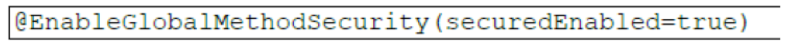

## How are these annotations implemented?
Method-level security is accomplished using Spring AOP proxies.

## In which security annotation are you allowed to use SpEL?
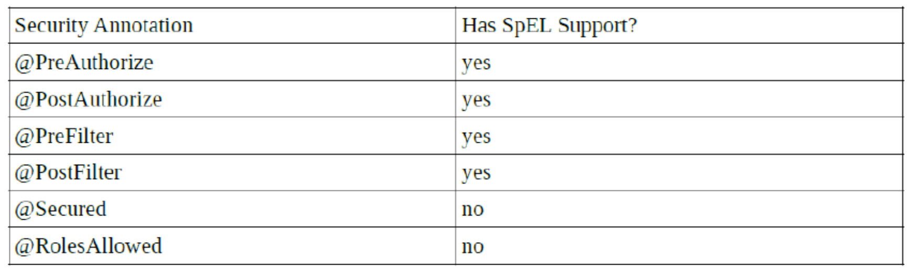

## Is it enough to hide sections of my output (e.g. JSP-Page or Mustache template)?
I would never consider information hiding as a sufficient security measure except for in the most trivial cases.

##Spring security offers a security tag library for JSP, would you recognize it if you saw it in an example?
First of all, if the Spring Security JSP tags are to be used in a JSP then the security taglib must be declared in the JSP in question using the following statement:
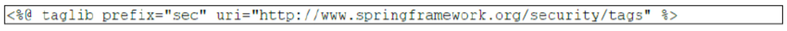

## The authorize Tag
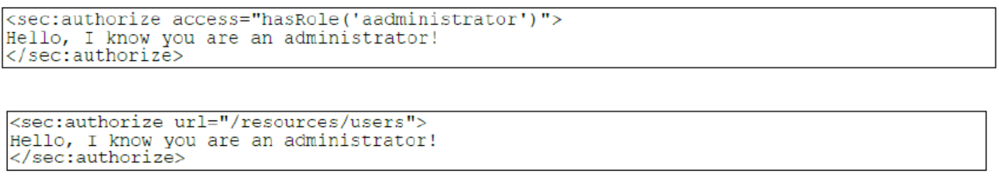

## The authentication Tag
The authentication tag allows for accessing the Authentication object in the current security context.


## The csrfInput Tag
When cross-site request forgery (CSRF) protection is enabled, this tag inserts a hidden form with the name and value of the CSRF protection token in the rendered page.


