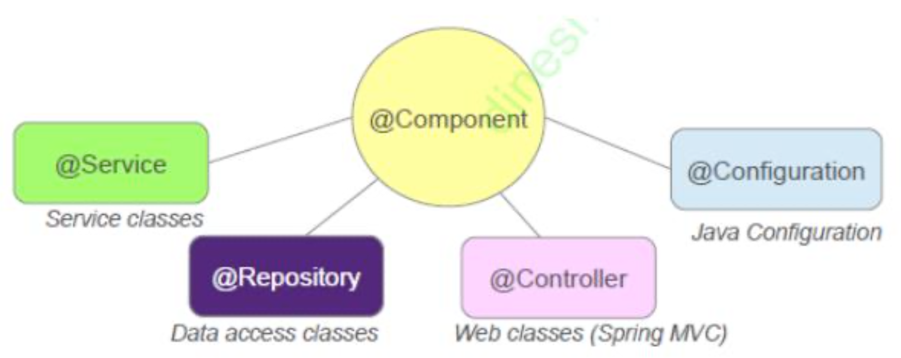
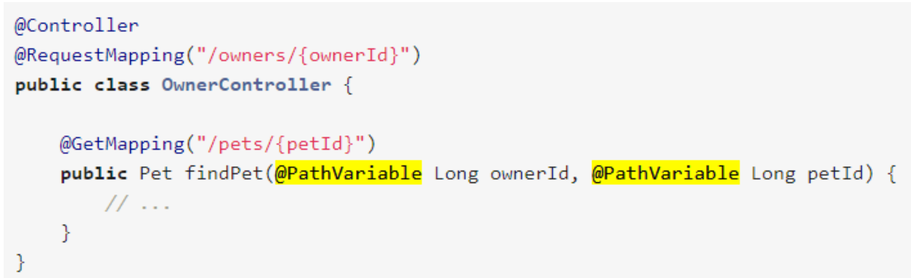
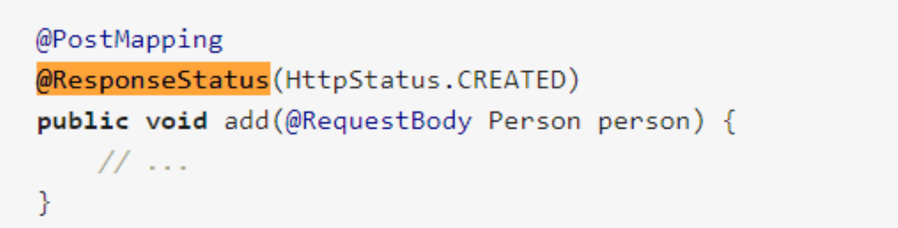
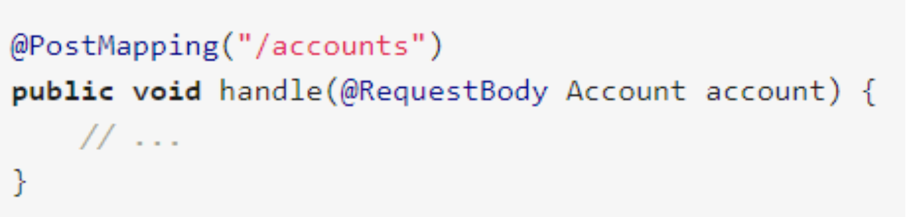
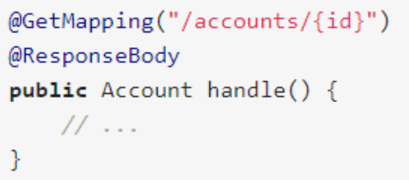

## What does REST stand for?
### Spring in Action 4th:
To understand what REST is all about, it helps to break down the acronym into its constituent parts:

- **Representational** – REST resources can be represented in virtually any form, including XML, JavaScript Object Notation (JSON), or even HTML—whatever form best suits the consumer of those resources.
- **State** – When working with REST, you’re more concerned with the state of a resource than with the actions you can take against resources.
- **Transfer**- REST involves transferring resource data, in some representational form, from one application to another.
- 
Put more succinctly, REST is about transferring the state of resources—in a representational form that is most appropriate for the client or server—from a server to a client (or vice versa).

## What is a resource?
A RESTful resource is anything that is addressable over the web. By addressable, we mean resources that can be accessed and transferred between clients and servers. Subsequently, a resource is a logical, temporal mapping to a concept in the problem domain for which we are implementing a solution. Here are some examples of REST resources:

- A news story
- The temperature in NY at 4:00 p.m. EST
- A tax return stored in the IRS database
- A list of code revision history in a repository such as SVN or CVS 
- A student in a classroom in a school
- A search result for a particular item in a web index, such as Google

##What does CRUD mean?
That said, there are actions in REST, and they’re defined by HTTP methods. 

Specifically, GET, POST, PUT, DELETE, PATCH, and other HTTP methods make up the verbs in REST. 

### These HTTP methods are often mapped to CRUD verbs as follows:

- Create – POST
- Read – GET
- Update – PUT or PATCH
- Delete – DELETE

## Is REST secure? What can you do to secure it?
REST by default is not secure.

You can use one of the following to secure REST:

- OAuth2;
- JSON Web Tokens (JWT);
- Basic Authentication.

## What are safe REST operations?
Safe methods are HTTP methods that do not modify resources. 

### These are: 
- GET
- HEAD
- OPTIONS

## What are idempotent operations? Why is idempotency important?
An idempotent HTTP method is a HTTP method that can be called many times without different outcomes. It would not matter if the method is called only once, or ten times over. The result should be the same.

Idempotency is important in building a fault-tolerant API. Suppose a client wants to update a resource through POST. Since POST is not a idempotent method, calling it multiple times can result in wrong updates. 

What would happen if you sent out the POST request to the server, but you get a timeout. Is the resource actually updated? Does the timeout happened during sending the request to the server, or the response to the client? Can we safely retry again, or do we need to figure out first what has happened with the resource? 

By using idempotent methods, we do not have to answer this question, but we can safely resend the request until we actually get a response back from the server.
    
## Is REST scalable and/or interoperable?
REST is scalable, because it is stateless. By stateless it means that the server does not store any state about the client session on the server side.
The client's application state should never be stored on the server, but passed around from the client to every place that needs it. 

That is where the ST in REST comes from, State Transfer. You transfer the state around instead of having the server store it. This is the only way to scale to millions of concurrent users. If for no other reason than because millions of sessions is millions of sessions.

With respect to software, the term interoperability is used to describe the capability of different programs to exchange data via a common set of exchange formats, to read and write the same file formats, and to use the same protocols.

### A few levels of interoperability:
- Interoperability between HTTP clients. Different clients should send the same HTTP requests to convey the same messages;
- Interoperability at the level of MIME type. Different clients should PUT and POST the same documents to convey the same state, and should interpret the server's response documents the same way.

## Which HTTP methods does REST use?
- Create - POST
- Read - GET
- Update - PUT or PATCH
- Delete – DELETE
- HEAD - This method is the same as the GET request, but it only transfers the status line and the header section without the response body.

## What is an HttpMessageConverter?
```public interface HttpMessageConverter<T>```
Strategy interface that specifies a converter that can convert from and to HTTP requests and responses.
  
Short: HttpMessageConverters convert HTTP requests to objects and back from objects to HTTP responses. Spring has a list of converters that is registered by default but it is customizable – additional implementations may be plugged in.

Message conversion is a more direct way to transform data produced by a controller into a representation that’s served to a client. When using message conversion, DispatcherServlet doesn’t bother with ferrying model data to a view. In fact, there is no model, and there is no view. There is only data produced by the controller and a resource representation produced when a message converter transforms that data.

### Spring comes with a variety of message converters:
- BufferedImageHttpMessageConverter: Converts BufferedImage to and from image binary data;
- Jaxb2RootElementHttpMessageConverter: Reads and writes XML (either text/xml or application/xml) to and from JAXB2-annotated objects. Registered if JAXB v2 libraries are present on the classpath;
- MappingJackson2HttpMessageConverter: Reads and writes JSON to and from typed objects or untyped HashMaps. Registered if the Jackson 2 JSON library is present on the classpath;
- StringHttpMessageConverter: Reads all media types (*/*) into a String. Writes String to text/plain.
- ....

For example, suppose the client has indicated via the request’s Accept header that it can accept application/json. Assuming that the Jackson JSON library is in the application’s classpath, the object returned from the handler method is given to MappingJacksonHttpMessageConverter for conversion into a JSON representation to be returned to the client. 

On the other hand, if the request header indicates that the client prefers text/xml, then Jaxb2RootElementHttpMessageConverter is tasked with producing an XML response to the client.

## Is REST normally stateless?
Yes. Stateless: There should be no need for the service to keep user sessions. In other words, each request should be independent of the others. This improves scalability, as the server does not need to manage the state across multiple requests, with some trade-off on the network performance.

## What does @RequestMapping do?
You can use the @RequestMapping annotation to map requests to controllers methods. It has various attributes to match by URL, HTTP method, request parameters, headers, and media types. You can use it at the class level to express shared mappings or at the method level to narrow down to a specific endpoint mapping.

# Is @Controller a stereotype? Is @RestController a stereotype?
```
@Controller is a stereotype. 

@Target(value=TYPE)
@Retention(value=RUNTIME) 
@Documented
@Component
public @interface Controller
```

```
@Target(value=TYPE) 
@Retention(value=RUNTIME) 
@Documented
@Controller
@ResponseBody
public @interface RestController
```
RestController is a convenience annotation that is itself annotated with **@Controller and @ResponseBody**.

## What is a stereotype annotation? What does that mean?
The Spring Framework provides you with some special annotations. These annotations are used to create Spring beans automatically in the application context. The main stereotype annotation is @Component. By using this annotation, Spring provides more Stereotype meta annotations such as @Service, used to create Spring beans at the Service layer, @Repository, which is used to create Spring beans for the repositories at the DAO layer, and @Controller, which is used to create Spring beans at the controller layer. 

### This is depicted in the following diagram:


## What is the difference between @Controller and @RestController?
**@Controller** result is passed to a view.
**@RestController** result is processed by a HttpMessageConverter.

For a **@Controller** to act as a **@RestController** it has to be combined with **@ResponseBody**.

## When do you need @ResponseBody?
**@RestController** is a composed annotation that is itself meta-annotated with **@Controller** and **@ResponseBody** to indicate a controller whose every method inherits the type-level **@ResponseBody** annotation and, therefore, writes directly to the response body versus view resolution and rendering with an HTML template.

The return value is converted through HttpMessageConverter implementations and written to the response. See **@ResponseBody**.

### Short: 
**@ResponseBody** is required when you want a controller result to me passed to a message converter rather than to a view resolver.

## What does @PathVariable do?
Annotation which indicates that a method parameter should be bound to a URI template variable. 

Supported for RequestMapping annotated handler methods.

If the method parameter is Map<String, String> then the map is populated with all path variable names and values.


You can explicitly name URI variables (for example, @PathVariable("customId")), but you can leave that detail out if the names are the same and your code is compiled with debugging information or with the -parameters compiler flag on Java 8.

### Short: 
@PathVariable gets parameters for a controller method from the URI of the request.

## What are the HTTP status return codes for a successful GET, POST, PUT or DELETE operation?
```
GET
200 OK
POST
200 OK
201 Created 
204 No Content
PUT
200 OK
201 Created 
204 No Content
```
### DELETE
Direct answer to DELETE may be a 204 No Content or a 202 Accepted (long lasting processing) or 205 Reset Content (DELETE statement was ok but could not be performed). 

An indirect answer is 200 OK with some response.

## When do you need @ResponseStatus?
The status code is applied to the HTTP response when the handler method is invoked and overrides status information set by other means, like ResponseEntity or "redirect:".
A method with a void return type (or null return value).

There are two places where this can be applied:

- Controller Methods;
- Error Handlers

## Note:
When we set reason, Spring calls HttpServletResponse.sendError(). Therefore, it will send an HTML error page to the client, which makes it a bad fit for REST endpoints. For such cases it is preferable to use a ResponseEntity as a return type and avoid the use of @ResponseStatus altogether.

**Also note, that Spring only uses @ResponseStatus, when the marked method completes successfully (without throwing an Exception).**

## Where do you need @ResponseBody? What about @RequestBody?
### @RequestBody
You can use the @RequestBody annotation to have the request body read and deserialized into an Object through an HttpMessageConverter. 

### The following example uses a @RequestBody argument:


You can use @RequestBody in combination with javax.validation.Valid or Spring’ s @Validated annotation, both of which cause Standard Bean Validation to be applied. By default, validation errors cause a MethodArgumentNotValidException, which is turned into a 400 (BAD_REQUEST) response.

### @ResponseBody
You can use the @ResponseBody annotation on a method to have the return serialized to the response body through an HttpMessageConverter. 
### The following listing shows an example:


## Do you need Spring MVC in your classpath?
Yes. Spring MVC is the core component for REST support.

## What Spring Boot starter would you use for a Spring REST application?
spring-boot-starter-web

## What are the advantages of the RestTemplate?
RestTemplate is a synchronous client to perform HTTP requests. It is the original Spring REST client and exposes a simple, template-method API over underlying HTTP client libraries.

The RestTemplate provides a higher level API over HTTP client libraries. It makes it easy to invoke REST endpoints in a single line.
### Methods:

- getForObject;
- getForEntity;
- headForHeaders;
- postForObject;
- postForEntity;
- put;
- patchForObject;
- delete;
- optionsForAllow;
- exchange (general method);
- execute (most general).