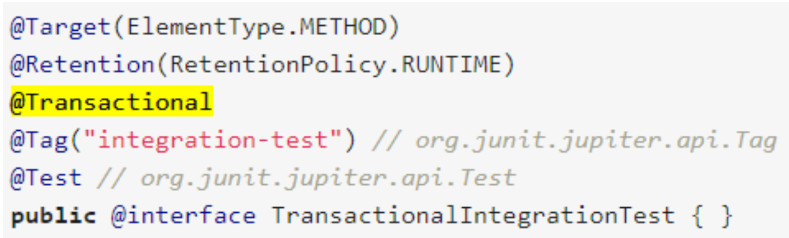
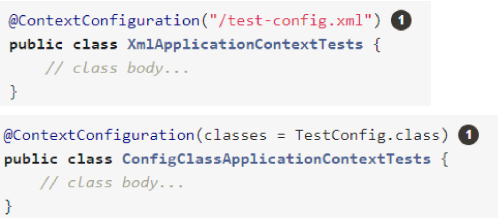
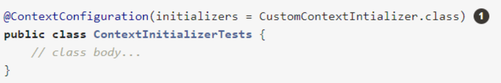
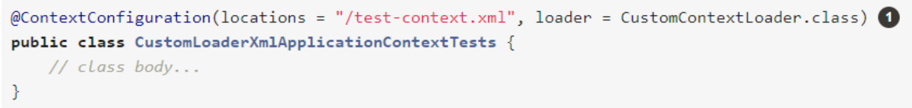

## Do you use Spring in a unit test?
No. As most of the time unit tests do not require infrastructure. Use mock objects to test code in isolation.

For certain unit testing scenarios, however, the Spring Framework provides mock objects and testing support classes:

- Environment. MockEnvironment and MockPropertySource are useful for developing out-of-container tests for code that depends on environment-specific properties;
- JNDI;
- Servlet API. The org.springframework.mock.web package contains a comprehensive set of Servlet API mock objects that are useful for testing web contexts, controllers, and filters. These mock objects are targeted at usage with Spring’s Web MVC framework;
- Spring Web Reactive.
- 
**General Testing Utilities**
The org.springframework.test.util package contains several general purpose utilities for use in unit and integration testing.
**Spring MVC Testing Utilities**

## What type of tests typically use Spring?
The Spring Framework provides first-class support for integration testing in the spring-test module.

## How can you create a shared application context in a JUnit integration test?
The Spring TestContext Framework provides consistent loading of Spring ApplicationContext instances and WebApplicationContext instances as well as caching of those contexts. 

Support for the caching of loaded contexts is important, because startup time can become an issue.

By default, once loaded, the configured ApplicationContext is reused for each test. Thus, the setup cost is incurred only once per test suite, and subsequent test execution is much faster.

To create shared application context you have to annotate a JUnit 4 based test class with @RunWith(SpringJUnit4ClassRunner.class) or @RunWith(SpringRunner.class).
  
### However, @RunWith will try to initialize default @ContextConfiguration:

- Instantiating TestContextBootstrapper for test class DemoApplicationTests from class org.springframework.test.context.support.DefaultTestContextBoots trapper;
- Neither @ContextConfigurat ion nor @ContextHierarchy found for test class DemoApplicationTests, using DelegatingSmartContextLoader
- org.springframework.test.context.support.AbstractDele gatingSmartContextLoader - Delegating to GenericXmlContextLoader to process context configura tion declaringClass = 'DemoApplicationTests', contextLoaderClass = 'org.springframework.test.context.Context Loader'].
- org.springframework.test.context.support.AbstractContext Loader - Did not detect default resource location for test class DemoApplicationTests: class path resource [com/qualifiertest/demo/DemoApplicationTests-context.xml] does not exist;
- org.springframework.test.context.support.AbstractContextLoader - Could not detect default resource locations for test class DemoApplicationTests: no resource found for suffixes {-context.xml}.
- org.springframework.test.context.support.AbstractDele gatingSmartContextLoader - Delegating to AnnotationConfigContextLoader to process context configura tion declaringClass = 'DemoApplicationTests', contextLoaderClass = 'org.springframework.test.context.Context Loader' .
- org.springframework.test.context.support.Annotat ionConf igC onte xtLoa derUtils - Could not detect default configuration classes for test class DemoApplicationTests : DemoApplicationTests does not declare any static, non-private, non-final, nested classes annotated with @Configuration.

If it does find – it will fail. 

**That is why you need to use @ContextConfiguration to point @Configuration classes.**

## When and where do you use @Transactional in testing?
Annotating a test method with @Transactional causes the test to be run within a transaction that is, by default, automatically rolled back after completion of the test. 

If a test class is annotated with @Transactional, each test method within that class hierarchy runs within a transaction. 

Test methods that are not annotated with @Transactional (at the class or method
level) are not run within a transaction. 
Furthermore, tests that are annotated with @Transactional but have the propagation type set to NOT_SUPPORTED are not run within a transaction.

Also, you can create custom annotations to include more than one spring test annotation:


## How are mock frameworks such as Mockito or EasyMock used?
```
@SpringBootTest
public class HelloServiceMockTest {

    @Mock
    private HelloRepository helloRepository;

    @InjectMocks // auto inject helloRepository
    private HelloService helloService = new HelloServiceImpl();

    @BeforeEach
    void setMockOutput() {
        when(helloRepository.get()).thenReturn("Hello Mockito From Repository");
    }

    @DisplayName("Test Mock helloService + helloRepository")
    @Test
    void testGet() {
        assertEquals("Hello Mockito From Repository", helloService.get());
    }

}
```
## How is @ContextConfiguration used?
**@ContextConfiguration** defines class-level metadata that is used to determine how to load and configure an ApplicationContext for integration tests. 

Specifically, **@ContextConfiguration** declares the application context resource locations or the annotated classes used to load the context.

Resource locations are typically XML configuration files or Groovy scripts located in the classpath, while annotated classes are typically @Configuration classes. 

However, resource locations can also refer to files and scripts in the file system, and annotated classes can be component classes, and so on.

As an alternative or in addition to declaring resource locations or annotated classes, you can use **@ContextConfiguration** to declare ApplicationContextInitializer classes. 
### The following example shows such a case:

You can optionally use @ContextConfiguration to declare the ContextLoader strategy as well. Note, however, that you typically do not need to explicitly configure the loader, since the default loader supports initializers and either resource locations or annotated classes.


## How does Spring Boot simplify writing tests?
Spring Boot provides a number of utilities and annotations to help when testing your application. Test support is provided by two modules: **spring-boot-test** contains core items, and **spring-boot-test-autoconfigure** supports auto-configuration for tests.

Most developers use the spring-boot-starter-test “Starter”, which imports both Spring Boot test modules as well as JUnit, AssertJ, Hamcrest, and a number of other useful libraries.

Spring Boot provides a **@SpringBootTest** annotation, **which can be used as an alternative to the standard spring-test @ContextConfiguration annotation when you need Spring Boot features.** The annotation works by creating the ApplicationContext used in your tests through SpringApplication.

When testing Spring Boot applications, this is often not required. Spring Boot’s @*Test annotations search for your primary configuration automatically whenever you do not explicitly define one.

The search algorithm works up from the package that contains the test until it finds a class annotated with @SpringBootApplication or @SpringBootConfiguration.

By default, @SpringBootTest will not start a server. You can use the webEnvironment attribute of @SpringBootTest to further refine how your tests run:

- MOCK (default);
- RANDOM_PORT: Loads WebServerApplicationContext;
- DEFINED_PORT: Loads WebServerApplicationContext;
  
- NONE: Loads an ApplicationContext by using SpringApplication but does not provide any web environment (mock or otherwise).

### Additional annotations:
- @AutoConfigureWebTestClient
- @AutoConfigureMockMvc
- @JsonTest
- @WebMvcTest: @WebMvcTest auto-configures the Spring MVC infrastructure and
limits scanned beans to @Controller, @ControllerAdvice, @JsonCompone nt, Converter, GenericConverter, Filter, WebMvcConfigurer, and HandlerMethodArgumentResolver. Regular @Component beans are not scanned when using this annotation.
- @DataJpaTest: By default, data JPA tests are transactional and roll back at the end of each test.
- @JdbcTest

## What does @SpringBootTest do? How does it interact with @SpringBootApplication and @SpringBootConfiguration?

Annotation that can be specified on a test class that runs Spring Boot based tests. Provides the following features over and above the regular Spring TestContext Framework:

- Uses SpringBootContextLoader as the default ContextLoader when no specific @ContextConfiguration(loader=...) is defined.
- Automatically searches for a @SpringBootConfiguration when nested @Configuration is not used, and no explicit classes are specified.
- Allows custom Environment properties to be defined using the properties attribute.
- Provides support for different webEnvironment modes, including the ability to start a
fully running web server listening on a defined or random port.
- Registers a TestRestTemplate and/or WebTestClient bean for use in web tests that are
using a fully running web server.
 
## How does it interact with @SpringBootApplication and @SpringBootConfiguration?
When testing Spring Boot applications, this is often not required. Spring Boot’s @*Test annotations search for your primary configuration automatically whenever you do not explicitly define one.
The search algorithm works up from the package that contains the test until it finds a class annotated with @SpringBootApplication or @SpringBootConfiguration. As long as you structured your code in a sensible way, your main configuration is usually found.
